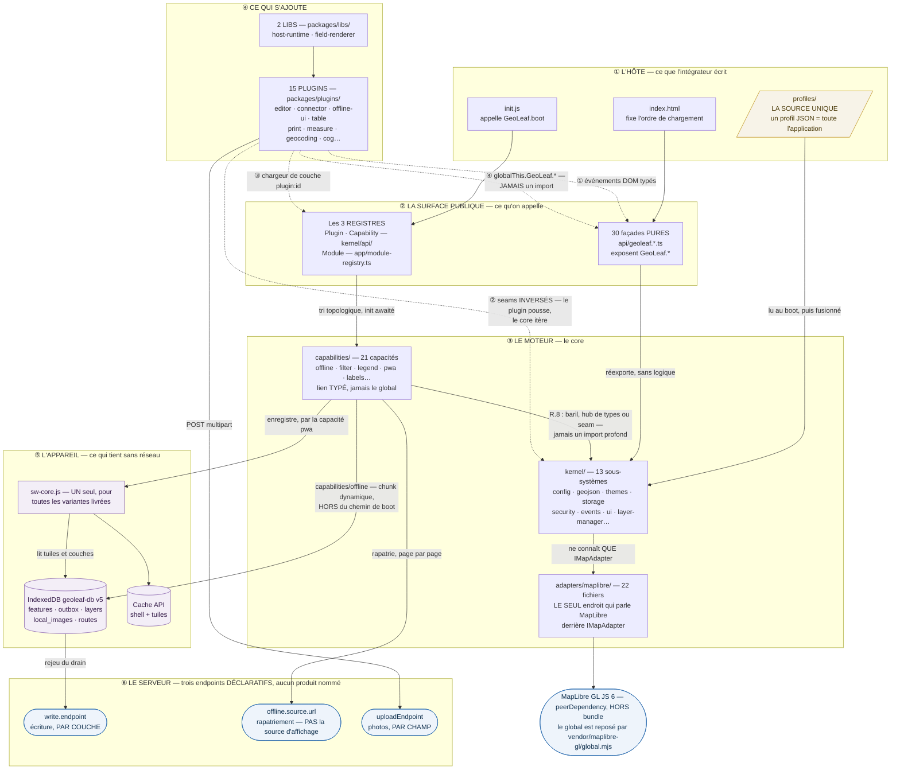
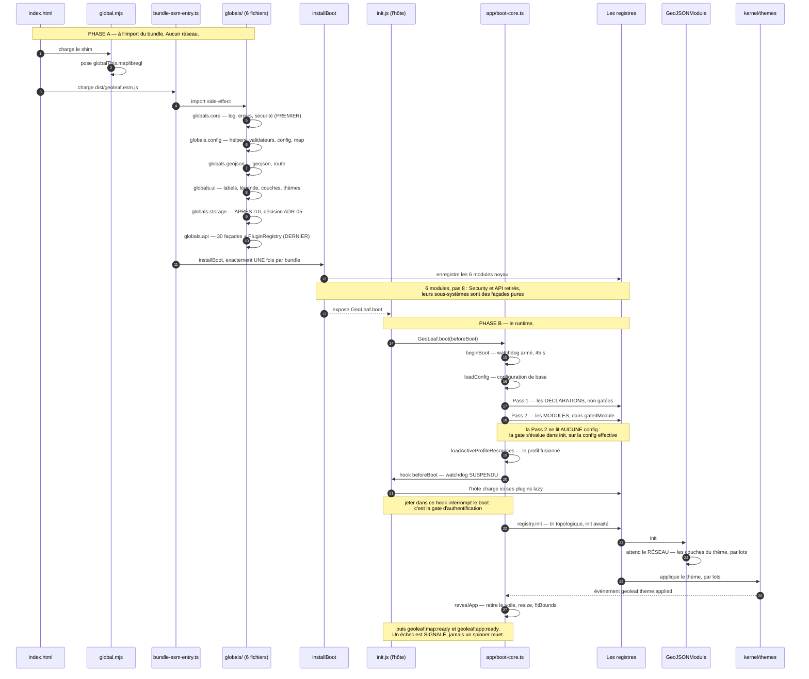
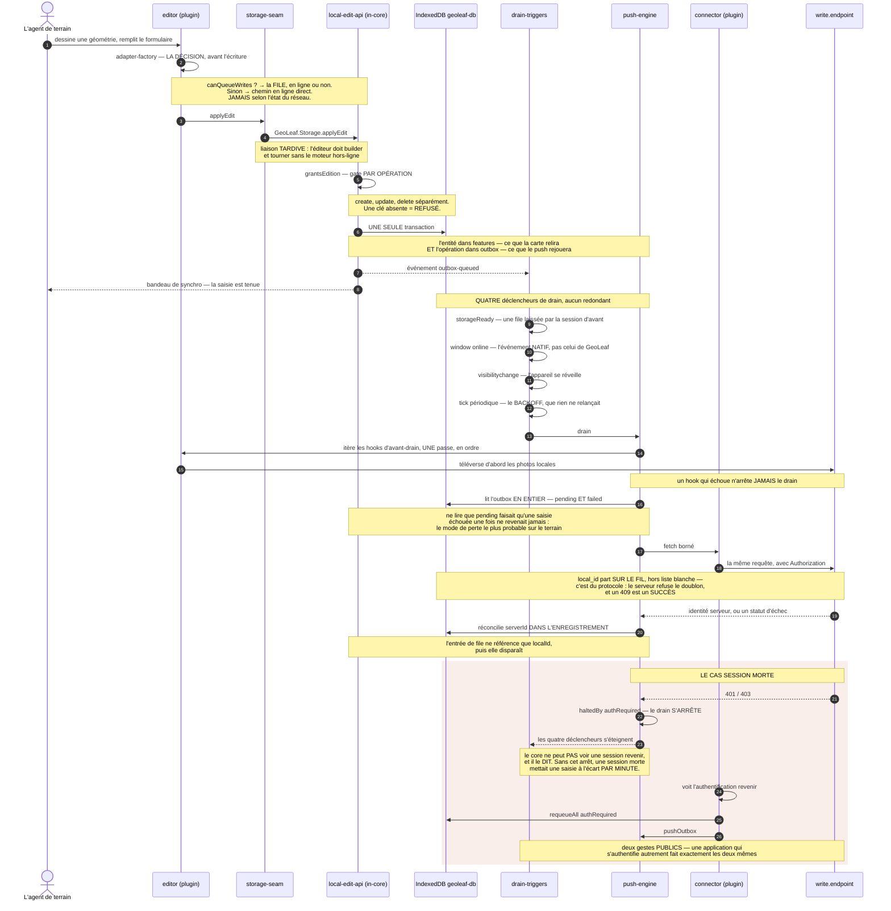

# Carte du fonctionnement — qui fait quoi

> **À quoi sert cette page.** Répondre à « qui fait quoi » **sans lire le code ni la doc**.
> Chaque nœud porte son chemin : le graphe est un **index de navigation**, pas une illustration.
> On regarde le graphe, on lit le chemin, on ouvre le bon fichier.
>
> **Autorité.** [`docs/specs/CDC_kernel.md`](../specs/CDC_kernel.md) pour le kernel et le boot ;
> [`DIRECTION.md`](../../packages/core/docs/DIRECTION.md) pour le périmètre produit.
> ⚠️ `docs/specs/contrats/INITIALIZATION_FLOW.md` porte un diagramme de séquence
> **partiellement périmé** — il cite encore un plugin de stockage, POI et `app/init.ts`. Ne rien
> en dériver.
>
> **Ce que cette page n'est pas.** Elle ne documente aucun usage (→
> [`GETTING_STARTED`](../../packages/core/docs/GETTING_STARTED.md)) et ne spécifie aucun contrat
> (→ [`specs/`](../specs/CDC_kernel.md)). Elle **renvoie** aux deux.

---

## Vue 1 — La carte des acteurs

Les **quatre canaux** par lesquels un plugin atteint le core sont dessinés comme **quatre arêtes
distinctes en pointillé**, et aucun n'est un `import` : c'est la forme que la règle
`no-plugin-in-core` impose. L'**ordre de chargement**, lui, n'est pas ici — il est en vue 2.

📌 **Lire les chemins.** Dans les étages ② et ③, ils sont relatifs à
`packages/core/src/` — `kernel/`, `capabilities/`, `api/`, `app/`, `adapters/maplibre/`.
Partout ailleurs ils partent de la racine du dépôt.

### Répondre à une question avec ce graphe

| Ma question                           | Le nœud à regarder                              | Où j'ouvre                                                                                        |
| ------------------------------------- | ----------------------------------------------- | ------------------------------------------------------------------------------------------------- |
| La carte ne s'affiche pas du tout     | le nœud MapLibre, puis ①                        | `vendor/maplibre-gl/global.mjs` — et **le type MIME `.mjs` du serveur** : sans lui, rien ne boote |
| Dans quel ordre les choses se montent | ② et ③                                          | **Vue 2** ci-dessous                                                                              |
| Où se décide l'affichage d'une couche | ③ `kernel/` → `adapters/maplibre/`              | `packages/core/src/kernel/geojson/loader/single-layer.ts`                                         |
| Comment j'ajoute un comportement      | ④ — et la question est « capacité ou plugin ? » | §Dépendances et frontières de [`CDC_kernel.md`](../specs/CDC_kernel.md)                           |
| Comment un plugin parle au core       | les **quatre** arêtes en pointillé              | [`PLUGIN_ARCHITECTURE_SPEC.md`](../specs/contrats/PLUGIN_ARCHITECTURE_SPEC.md)                    |
| Où passe une écriture                 | ⑤ et ⑥                                          | **Vue 3** ci-dessous                                                                              |
| Qui parle à MapLibre                  | ③ `adapters/maplibre/` — **et lui seul**        | `packages/core/src/contracts/map-adapter.contract.ts`                                             |
| Où se configure tout ça               | le nœud `profiles/`                             | [`PROFILE_CONTRACT_SPEC.md`](../specs/contrats/PROFILE_CONTRACT_SPEC.md)                          |

---

## Vue 2 — Le boot, en DEUX phases

⚠️ **« B1→B11 » ne sont pas onze étapes d'exécution.** Ce sont des étiquettes historiques
regroupées dans **six** fichiers `globals.*`, et l'ordre est encodé par **l'ordre des `import`
ESM** — pas par une convention externe. Il n'existe pas de `globals.poi.ts` : tout « B10 POI »
décrit un état révolu.

La frontière entre les deux phases est la seule chose à retenir : **la phase A ne touche pas le
réseau et ne passe pas par les registres** — les façades sont un _prérequis_ des registres, pas
leur produit.

**Le fait qui coûte cher à ignorer** : la révélation de l'application est conditionnée à
`geoleaf:theme:applied`. Un thème qui n'arrive jamais laisse le voile en place — c'est
`app/init-reveal.ts` qui le retire, et lui seul.

---

## Vue 3 — Le cycle d'écriture hors-ligne

C'est l'axe le plus différenciant du produit, et le moins lisible dans le code.

🛑 **Le chemin en ligne n'est PAS un repli.** La décision est prise **avant** l'écriture, sur la
**capacité de l'appareil à tenir la file** — jamais sur la météo du réseau. Une écriture ne
change donc **jamais de chemin en vol**. Le prédécesseur décidait par joignabilité et produisait
un doublon indétectable : le chemin en ligne ne mettait aucune identité client sur le fil, la
file oui.

**Le rejeu manuel** suit le même moteur : le bouton du panneau de synchro d'`offline-ui` appelle
le handler qu'`editor` a poussé dans le seam, qui délègue au **même** `push-engine` in-core. Le
handler reste **silencieux** : `offline-ui` possède le message du bouton qu'il pilote, sinon
l'utilisateur recevrait deux notifications pour une seule action.

---

## Ce que ces trois vues ne couvrent pas

- **Le hors-ligne préparé** — déclaré dans le profil, téléchargé à l'avance, données _et_ tuiles :
  fiche [`docs/specs/capacites/offline.md`](../specs/capacites/offline.md).
- **Le détail des 21 capacités et des 15 plugins** : une fiche chacun sous
  [`docs/specs/`](../specs/CDC_kernel.md).
- **L'arbre de fichiers complet** : `docs/reference/ARBORESCENCE_QUALIFIEE.md`, **généré** par
  `npm run docs:tree`.
