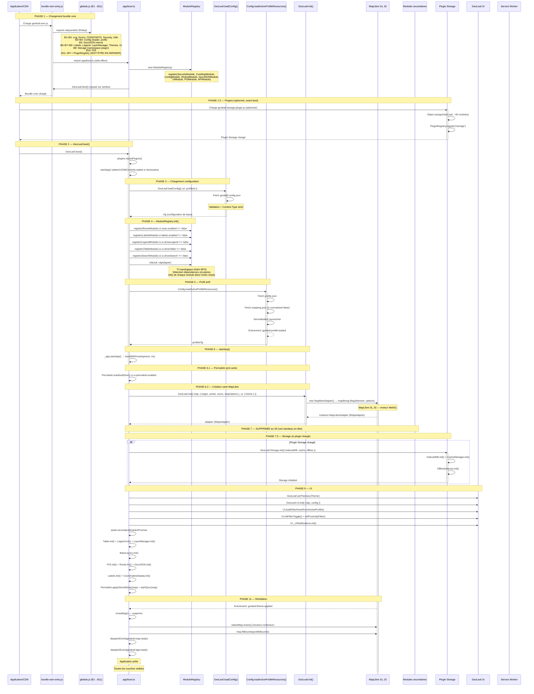

# GeoLeaf — Flux d'initialisation (v2.0.0)

> ⚠️ **Relu contre le code le 27/07/2026** (refonte documentaire V3). Annexe **vivante** du
> [`PLUGIN_ARCHITECTURE_SPEC.md`](PLUGIN_ARCHITECTURE_SPEC.md).
>
> **La « PHASE 7 — Modules secondaires (lazy loading) » de ce document N'EXISTE PLUS.**
> `bundle-esm-entry.ts:20` acte « BREAKING (S5) — `GeoLeaf._loadModule` and
> `GeoLeaf._loadAllSecondaryModules` are gone », et `packages/core/src/lazy/` n'existe pas.
> Les modules qu'elle listait (`poi-core`, `poi-renderers`, `route`, `layer-manager`,
> `legend`, `labels`, `themes`, `table`) sont devenus soit des **capacités in-core**
> (`capabilities/<id>/`), soit des **plugins**, soit ont été dissous — `poi` notamment.
>
> ⚠️ **Ne pas en conclure que tout le lazy a disparu** : `PluginRegistry.registerLazy()` et
> `.load()` sont **vivants** (`kernel/api/plugin-registry.ts`). C'est le lazy au niveau
> **bundle** ; ce qui a été retiré, c'est la **façade** `GeoLeaf._loadModule` et le
> répertoire `src/lazy/`.
>
> **La séquence réelle est en deux phases** — les façades à l'import (phase A, ordre ESM de
> `globals/globals.ts`), puis le runtime au `ModuleRegistry` (phase B, tri topologique). Elle
> est décrite à jour dans [`../CDC_kernel.md`](../CDC_kernel.md) §Séquence de boot ; ce
> document en garde le **détail des points de synchronisation**, qui reste utile.
>
> Chemins corrigés dans la passe : `built-in/config/` → `kernel/config/`,
> `modules/built-in/api/` → `kernel/api/`, `packages/plugins/storage/` → `offline-ui`.
> ⚠️ `app/init.ts` et `api/geoleaf.poi.ts`, cités en repères de debug, **n'existent plus** —
> les points d'arrêt correspondants sont à re-situer dans `app/boot-core.ts`.
>
> 🛑 **Passe du 08/08/2026 (S11.4) — `_app.initApp()` N'EXISTE PAS, et ce document le mettait en
> PHASE 6 de son diagramme.** La façade a été supprimée au S3/A-1 ; le point d'entrée réel est
> **`_app.startApp`**, lié à **`bootWithPreset(preset, ctx)`** (`app/boot-install.ts:142`,
> `app/boot-core.ts:159`). Corrigé ici aux quatre sites où il était décrit comme un APPEL.
>
> ⚠️ **Les marques de performance `geoleaf:initApp:start` / `:ready` gardent leur nom, et ce n'est
> pas un résidu** : `app/boot-core.ts:188` dit explicitement qu'elles doivent rester — la marque et
> le `measure("geoleaf:startup-total", …)` qui les relie en dépendent. Ne pas les « harmoniser ».

**Version produit :** GeoLeaf Platform V2

> **Annexe de référence du [Plugin Contract v1](PLUGIN_ARCHITECTURE_SPEC.md).** Document **descriptif et vivant** (il suit le code de boot). Les règles **normatives figées** vivent dans [`PLUGIN_ARCHITECTURE_SPEC.md`](PLUGIN_ARCHITECTURE_SPEC.md) — en cas de divergence, la spec prévaut.

---

## Vue d'ensemble

Ce document trace le **flux d'initialisation complet** de GeoLeaf V2, depuis le chargement des modules jusqu'à l'affichage final de la carte avec toutes ses couches. La V2 introduit deux évolutions majeures par rapport à la V1 :

1. **MapLibre GL JS ^6.0.0** comme moteur cartographique (a remplacé Leaflet en v2.0.0)
2. **ModuleRegistry** : gestion du cycle de vie des modules via un graphe de dépendances (tri topologique)

---

## Diagramme de séquence — Initialisation complète



---

## Tableau des étapes critiques

| #         | Étape                         | Fichier source                           | Point de synchronisation                           | Erreurs courantes                      |
| --------- | ----------------------------- | ---------------------------------------- | -------------------------------------------------- | -------------------------------------- |
| **1**     | Chargement bundle core        | `bundle-esm-entry.ts` → `geoleaf.esm.js` | Imports Rollup (B1→B11)                            | Script 404, ordre incorrect            |
| **1.5**   | Plugins + enregistrement      | `geoleaf-*.plugin.js`                    | `PluginRegistry.register()`                        | Plugin 404, namespace conflit          |
| **2**     | `GeoLeaf.boot()`              | `app/boot.ts`                            | `startApp()`                                       | GeoLeaf non défini                     |
| **3**     | Config globale                | `kernel/config/geoleaf-config/`          | `GeoLeaf.loadConfig()` Promise                     | JSON invalide, CORS                    |
| **4**     | ModuleRegistry.init()         | `app/module-registry.ts`                 | Tri topologique + init ordre                       | Dépendance circulaire, module manquant |
| **5**     | Profil actif                  | `kernel/config/profile.ts`               | `loadActiveProfileResources()`                     | profile.json 404, mapping manquant     |
| **6.2**   | Carte MapLibre                | `geoleaf.core.ts` + `MaplibreAdapter`    | `GeoLeaf.init()` synchrone                         | mapId invalide, MapLibre non chargé    |
| ~~**7**~~ | ~~Modules secondaires~~       | —                                        | **PHASE SUPPRIMÉE (S5)** — voir le bandeau en tête | —                                      |
| **7.5**   | Storage + SW                  | `geoleaf-storage.plugin.js`              | `Storage.init()` Promise                           | IndexedDB indisponible, SW 404         |
| **8**     | UI                            | `geoleaf.ui.ts`                          | `UI.init()` synchrone                              | Conteneurs DOM absents                 |
| **9**     | Couches (POI, GeoJSON, Route) | `geoleaf.poi.ts`, `geoleaf.geojson.ts`   | `init()` + Promises parallèles                     | GeoJSON malformé, coords invalides     |
| **11**    | Reveal + events               | `app/init.ts`                            | `geoleaf:theme:applied`                            | Bounds vides, timeout 5s de secours    |

---

## Points de synchronisation (Promises & Événements)

### Promises critiques

```javascript
// Chaîne principale
GeoLeaf.boot();
// → startApp()
// → GeoLeaf.loadConfig()
// → Config.loadActiveProfileResources()
// → _registry.init()
// → _app.startApp()  →  bootWithPreset(preset, ctx)
// → GeoLeaf._loadAllSecondaryModules()
```

### Événements DOM

| Événement                     | Émetteur        | Quand                                | Utilisation         |
| ----------------------------- | --------------- | ------------------------------------ | ------------------- |
| `geoleaf:plugin:loaded`       | PluginRegistry  | Plugin enregistré via `register()`   | Détection plugins   |
| `geoleaf:config:loaded`       | Config          | Config + profil chargés              | Init carte          |
| `geoleaf:profile:loaded`      | Profile         | Profil actif chargé                  | Toast notification  |
| `geoleaf:theme:applying`      | ThemeApplier    | Début chargement thème               | Toast loading       |
| `geoleaf:theme:applied`       | ThemeApplier    | Toutes les couches visibles chargées | Reveal + fitBounds  |
| `geoleaf:map:ready`           | app/init.ts     | Carte + couches prêtes               | Analytics, hooks    |
| `geoleaf:app:ready`           | app/init.ts     | Application entièrement initialisée  | Boot toast, metrics |
| `geoleaf:poi:click`           | POI             | Clic sur marqueur                    | Panneau latéral     |
| `geoleaf:basemap:change`      | Baselayers      | Changement fond de plan              | Analytics           |
| `geoleaf:storage:initialized` | Storage         | Storage initialisé                   | Cache ready         |
| `geoleaf:offline`             | OfflineDetector | Connexion perdue                     | Mode offline        |
| `geoleaf:online`              | OfflineDetector | Connexion rétablie                   | Synchronisation     |
| `geoleaf:sw:updated`          | sw-register     | Nouvelle version SW                  | Prompt reload       |
| `geoleaf:map:move`            | MaplibreAdapter | Fin de déplacement carte             | Permalink sync      |
| `geoleaf:map:zoom`            | MaplibreAdapter | Fin de zoom carte                    | Permalink sync      |

---

## ModuleRegistry — cycle de vie

Le `ModuleRegistry` (défini dans `app/module-registry.ts`) orchestre l'initialisation en respectant les dépendances déclarées :

```typescript
// Enregistrement (dans boot.ts, avant init())
const _registry = new ModuleRegistry();
_registry.register(new SecurityModule()); // id: 'security',  dependencies: []
_registry.register(new CoreMapModule()); // id: 'core-map',  dependencies: ['security']
_registry.register(new ConfigModule()); // id: 'config',    dependencies: []
_registry.register(new SharedModule()); // id: 'shared',    dependencies: ['config']
_registry.register(new GeoJSONModule()); // id: 'geojson',   dependencies: ['shared']
_registry.register(new UIModule()); // id: 'ui',        dependencies: ['core-map']
_registry.register(new POIModule()); // id: 'poi',       dependencies: ['shared']
_registry.register(new APIModule()); // id: 'api',       dependencies: [...]

// Après loadConfig() — modules optionnels selon profil
_registry.register(new RouteModule()); // si route.enabled !== false
_registry.register(new LabelsModule()); // si labels.enabled !== false
_registry.register(new LegendModule()); // si ui.showLegend !== false
_registry.register(new TableModule()); // si ui.showTable !== false
_registry.register(new SearchModule()); // si ui.showSearch !== false

// Initialisation — tri topologique (Kahn BFS)
await _registry.init(null, cfgAdapter);

// Accès après init
const poi = _registry.get<POIModule>("poi");
_registry.has("search"); // → true
_registry.getUISlots(); // → IModuleUISlot[] pour toolbar mobile + filtres desktop
_registry.destroy(); // teardown en ordre inverse
```

### Enregistrement public (modules tiers)

```javascript
// Avant GeoLeaf.boot()
GeoLeaf.registry.register(new MyCustomModule());
```

⚠️ **« Avant » n'est pas indicatif, et depuis le 07/08/2026 le kernel le DIT** (socle-init 7.2).
Un `register()` postérieur à `init()` est toujours accepté et le module est bien stocké — mais
**deux choses n'auront pas lieu**, et elles étaient l'une et l'autre silencieuses :

1. son `init()` n'est pas appelé — la boucle d'init a tourné une fois, sur un ordre topologique
   calculé avant que ce module n'existe ;
2. **son créneau UI n'est jamais rendu non plus.** `_appendRegistryIcons()` parcourt
   `registry.getAll()` **une seule fois**, depuis `createToolbarDom()`, qui a un appelant unique
   et n'est jamais rejoué. Un `mobileIcon` déclaré là est stocké et jamais dessiné.

C'est le point 2 qui faisait chercher un problème d'ORDRE là où il n'y en avait pas : le module
**est** enregistré, l'introspection le confirme, et rien n'apparaît. `ModuleRegistry.register()`
émet désormais un `Log.warn` nommant le module, les deux conséquences, et la voie supportée —
`GeoLeaf.plugins.registerLazyForAction()`, qui déclare le créneau **avant** le boot et charge le
bundle à la demande.

🛑 **Une ligne du diagramme ci-dessous est périmée, signalée le 07/08/2026 sans être réparée
ici** : `GeoLeaf._loadAllSecondaryModules()` **n'existe plus** — supprimé au S5 avec toute la
machinerie `src/lazy/`, comme l'écrit `bundle-esm-entry.ts:20-25`. Le seul reste dans le code
est un commentaire de `boot-modules/core-map-lifecycle.ts:321` qui décrit l'ancien montage. Le
diagramme n'a pas été réécrit parce que sa mise à jour demande de re-mesurer la séquence
entière, pas d'échanger un nom ; c'est un travail à part.

---

## Mécanisme de reveal

L'application est révélée (`#gl-loader` supprimé) uniquement lorsque toutes les couches visibles sont chargées :

```
GeoLeaf.boot()
    └── _app.startApp() → bootWithPreset()
            ├── GeoLeaf.init() → carte MapLibre créée
            ├── GeoLeaf._loadAllSecondaryModules() [fire & await]
            ├── BaseLayers.init() → thème par défaut appliqué
            │       └── → dispatch geoleaf:theme:applying
            ├── ... (POI, Route, GeoJSON, UI panels)
            ├── [attend geoleaf:theme:applied]
            │       ↓ (ou timeout 5s de secours)
            └── revealApp()
                    ├── #gl-loader → gl-loader--fade → display:none
                    ├── nativeMap.resize() (recalcul container)
                    ├── map.fitBounds(profileBounds)
                    ├── dispatch geoleaf:map:ready
                    └── dispatch geoleaf:app:ready
```

---

## Modes d'initialisation profil

### Mode layers-only (V2, recommandé)

```json
// profile.json — config.data.useLegacyProfileData = false (défaut)
{
    "layers": [
        {
            "id": "poi-restaurants",
            "type": "geojson",
            "url": "data/restaurants.geojson",
            "normalized": true,
            "clustering": true
        }
    ]
}
```

**Flux :** Config → Profile → GeoJSON.loadFromProfile() → MapLibre

### Mode legacy (pre-V1, rétrocompatibilité)

```javascript
// config.data.useLegacyProfileData = true
// poi.json + routes.json chargés séparément
```

**Flux :** Config → Profile → POI.init() → Route.draw() → MapLibre

---

## Mesures de performance

GeoLeaf émet des marques `performance.mark()` utilisables via les DevTools :

```javascript
// Marques émises automatiquement
performance.mark("geoleaf:initApp:start"); // début de _app.initApp()
performance.mark("geoleaf:initApp:ready"); // application révélée
performance.measure("geoleaf:startup-total", "geoleaf:initApp:start", "geoleaf:initApp:ready");

// Callback optionnel (passé à GeoLeaf.boot)
GeoLeaf.boot({
    onPerformanceMetrics: (metrics) => {
        console.log(metrics.startupTotalMs); // durée totale démarrage
        console.log(metrics.timeToMapReadyMs); // temps jusqu'à geoleaf:map:ready
        console.log(metrics.timeToAppReadyMs); // temps jusqu'à geoleaf:app:ready
    },
});
```

---

## Gestion d'erreurs

### Config introuvable

```javascript
// En cas d'échec de loadConfig() → startApp() retourne (abort)
// Vérifier :
// 1. URL de geoleaf.config.json correcte
// 2. CORS configuré sur le serveur
// 3. Content-Type: application/json
```

### ModuleRegistry — dépendance circulaire

```javascript
// Exemple : ModuleA dépend de ModuleB qui dépend de ModuleA
// GeoLeafError: ModuleRegistry: circular dependency detected: A → B → A
// Solution: revoir les déclarations `dependencies` dans les modules concernés
```

### Reveal non déclenché

```javascript
// geoleaf:theme:applied non émis → timeout de sécurité 5s
// Vérifier :
// 1. BaseLayers.init() appelé avec config valide
// 2. Pas d'erreur dans ThemeApplier
// 3. Aucune exception bloquante dans bootWithPreset()
```

---

## Debugging

### Ordre des requêtes réseau attendu

1. `profiles/geoleaf.config.json`
2. `profiles/{profileId}/profile.json`
3. `profiles/{profileId}/mapping.json` (si `normalized: false`)
4. `profiles/{profileId}/data/*.geojson` (parallèle)
5. Tuiles de basemap MapLibre (vecteur ou raster)
6. Chunks statiques ESM `dist/chunks/*.js` — produits par le code-splitting Rollup, PAS par un chargement à la demande

### Breakpoints recommandés

1. `app/boot.ts:79` → Application starting
2. `app/boot.ts:192` → After `_registry.init()`
3. `app/init.ts:109` → Map created via `GeoLeaf.init()`
4. `app/init.ts:612` → `revealApp()` called
5. `kernel/api/plugin-registry.ts` → `register()` — Plugin registered

---

## Références

- **Sources** : `packages/core/src/bundle-esm-entry.ts`, `packages/core/src/app/boot.ts`, `packages/core/src/app/module-registry.ts`
- **Contrats** : `packages/core/src/contracts/map-adapter.contract.ts`, `packages/core/src/contracts/core-module.contract.ts`
- **Adaptateur** : `packages/core/src/adapters/maplibre/`
- **Kernel** : `packages/core/src/kernel/` · **Capacités** : `packages/core/src/capabilities/`
- **Plugins** : `packages/plugins/offline-ui/`, `packages/plugins/editor/`
- **Tests** : `packages/core/__tests__/`, `e2e/`

> ⚠️ _Relu contre le disque le 10/08/2026, avant publication : cette liste citait
> `packages/core/src/app/init.ts` et `packages/plugins/addpoi/`, **qui n'existent ni l'un ni
> l'autre**. Le premier est déjà donné pour disparu par l'encart de tête de ce document, à
> quatre cents lignes d'ici — une liste de références n'est pas relue quand on corrige le
> corps, et c'est exactement ainsi qu'un document reste faux par un bout. `addpoi` a fusionné
> dans `editor` au Sprint 5._

---

**Dernière mise à jour :** mars 2026

**Version GeoLeaf :** 2.0.0 — Platform V2
