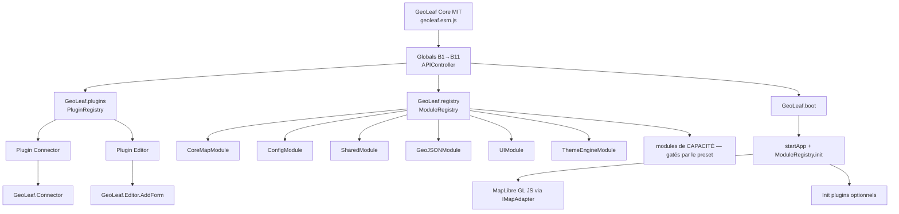
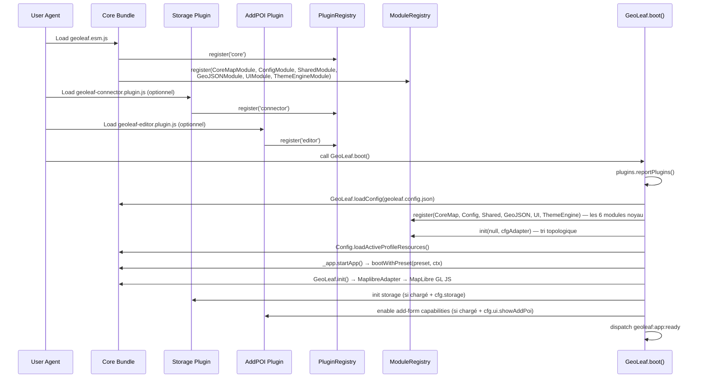

# Schéma d'architecture — Core, Plugins, Registry, Boot Sequence

> ⚠️ **Relu contre le code le 27/07/2026** (refonte documentaire V3). Annexe **vivante** du
> [`PLUGIN_ARCHITECTURE_SPEC.md`](PLUGIN_ARCHITECTURE_SPEC.md) : elle suit le code, elle n'est
> pas gelée. Corrections appliquées ci-dessous, avec leur motif.
>
> **La nuance qui compte, et que la version précédente écrasait :** il y avait **deux**
> mécanismes « lazy », et un seul a disparu.
>
> | Mécanisme                                                                        | État                                                                                                                               |
> | -------------------------------------------------------------------------------- | ---------------------------------------------------------------------------------------------------------------------------------- |
> | `PluginRegistry.registerLazy(name, resolver)` + `.load()`                        | **VIVANT** — les deux membres sont dans `kernel/api/plugin-registry.ts`. C'est le lazy au niveau bundle, utilisé par les capacités |
> | `GeoLeaf._loadModule()` · `GeoLeaf._loadAllSecondaryModules()` · `src/lazy/*.ts` | **SUPPRIMÉS** — `bundle-esm-entry.ts:20` : « BREAKING (S5) … are gone ». Le répertoire n'existe pas                                |
>
> Confondre les deux fait croire que le registre est mort ; il ne l'est pas.

**Version produit :** GeoLeaf Platform V2
**Version :** 2.0.0
**Date :** mars 2026

📌 **Ancrage des chemins.** Un chemin cité sans racine se lit depuis `packages/core/src/`. Un
chemin qui commence par `packages/`, `scripts/`, `profiles/`, `apps/` ou `docs/` est relatif à la
**racine du dépôt**.

> **Annexe de référence du [Plugin Contract v1](PLUGIN_ARCHITECTURE_SPEC.md).** Document **descriptif et vivant** (il suit le code). Les règles **normatives figées** vivent dans [`PLUGIN_ARCHITECTURE_SPEC.md`](PLUGIN_ARCHITECTURE_SPEC.md) — en cas de divergence, la spec prévaut.

---

## 1. Vue d'ensemble

GeoLeaf V2 est structuré autour d'un **core MIT** et de **plugins MIT optionnels**. Le core initialise l'application via deux registres complémentaires :

- **PluginRegistry** (`kernel/api/plugin-registry.ts`) — registre léger de plugins et modules lazy chargés à runtime. Surface publique via `GeoLeaf.plugins.*`.
- **ModuleRegistry** (`app/module-registry.ts`) — orchestrateur de cycle de vie des modules internes via graphe de dépendances (tri topologique). Surface publique via `GeoLeaf.registry`.

Les plugins enrichissent des namespaces existants (`GeoLeaf.Storage`, `GeoLeaf.POI.AddForm`, etc.) via le PluginRegistry.

---

## 2. Schéma logique



> ⚠️ **Ce graphe listait HUIT modules noyau et cinq optionnels — corrigé le 11/08/2026.**
> Il y a **six** modules noyau (`app/boot-install.ts:110` : _« S6 Lot 6: 6 kernel modules, not
> 8 »_) ; `SecurityModule` et `APIModule` étaient des enveloppes vidées, `POIModule` est dissous
> au S9, et `TableModule` / `SearchModule` n'ont **jamais eu de classe** dans ce dépôt. Les
> capacités (route, labels, legend…) ne sont plus des nœuds nommés : elles sont enregistrées par
> le preset (`presets/apply-preset.ts:203`), gatées par la config. Côté plugins, `AddPOI` a
> fusionné dans `editor` — le namespace vivant est `GeoLeaf.Editor.AddForm`.

---

## 3. Boot sequence (runtime)



---

## 4. PluginRegistry — API détaillée

Source : `packages/core/src/kernel/api/plugin-registry.ts`

### Structure interne

```typescript
// _registry : Map<name, PluginEntry>
interface PluginEntry {
    name: string;
    version: string | null;
    loaded: boolean;
    loadedAt: number; // timestamp ms
    requires: string[]; // dépendances obligatoires
    optional: string[]; // dépendances optionnelles
    label: string;
    healthCheck: (() => boolean) | null;
}

// _lazyResolvers : Map<name, () => Promise<void>>
// Peuplé par bundle-esm-entry.ts au démarrage
```

### Méthodes publiques

```typescript
// Enregistrement (appelé par les plugins et globals.js)
PluginRegistry.register(name: string, metadata?: {
    version?: string;
    requires?: string[];
    optional?: string[];
    label?: string;
    healthCheck?: () => boolean;
}): void;

// Enregistrement lazy (appelé par bundle-esm-entry.ts)
PluginRegistry.registerLazy(name: string, resolver: () => Promise<void>): void;

// Requête d'état
PluginRegistry.isLoaded(name: string): boolean;
PluginRegistry.canActivate(name: string): boolean;  // vérifie requires[]
PluginRegistry.getLoadedPlugins(): string[];
PluginRegistry.getAvailableModules(): string[];     // chargés + lazy disponibles
PluginRegistry.getInfo(name: string): PluginEntry | null;

// Chargement lazy
PluginRegistry.load(name: string): Promise<void>;   // rejette si inconnu

// Rapport console (appelé par GeoLeaf.boot)
PluginRegistry.reportPlugins(): void;                // silencieux si core-only
```

### Événements émis

| Événement                    | Quand                              |
| ---------------------------- | ---------------------------------- |
| `geoleaf:plugin:loaded`      | Plugin enregistré via `register()` |
| `geoleaf:plugin:lazy-loaded` | Module lazy chargé avec succès     |
| `geoleaf:plugin:failed`      | Échec du chargement lazy           |

---

## 5. ModuleRegistry — cycle de vie

Source : `packages/core/src/app/module-registry.ts`

### Algorithme d'initialisation

```
register(module) [0..N fois]
    ↓
init(adapter, config)
    ├── _topoSort()  ← Kahn's BFS
    │     ├── Validation : toutes les dépendances déclarées sont enregistrées
    │     ├── Calcul in-degree et adjacence inverse
    │     ├── Queue BFS depuis les modules sans dépendances
    │     └── Si cycle → DFS pour trouver le chemin → GeoLeafError "A → B → A"
    │
    └── Pour chaque module dans l'ordre résolu :
            await module.init(adapter, config)
```

### Teardown

```
destroy()
    └── Pour chaque module dans l'ordre INVERSE d'initialisation :
            module.destroy()  ← erreurs loguées mais n'interrompent pas le teardown
```

### Accès public via `GeoLeaf.registry`

```typescript
// Avant GeoLeaf.boot() — enregistrement de modules tiers
GeoLeaf.registry.register(new MyCustomModule());

// Après init() — accès aux modules
const geojson = GeoLeaf.registry.get<GeoJSONModule>("geojson");
GeoLeaf.registry.has("search"); // → boolean
GeoLeaf.registry.getAll(); // → readonly ICoreModule[]
GeoLeaf.registry.getUISlots(); // → IModuleUISlot[] (toolbar mobile + filtres desktop)
```

---

## 6. APIController

Source : `packages/core/src/kernel/api/controller.ts`

Orchestrateur principal des opérations API GeoLeaf. Gère trois managers spécialisés :

| Manager          | Classe                     | Rôle                                   |
| ---------------- | -------------------------- | -------------------------------------- |
| `module`         | `APIModuleManager`         | Accès aux modules par nom              |
| `initialization` | `APIInitializationManager` | `init()`, `loadConfig()`, `setTheme()` |
| `factory`        | `APIFactoryManager`        | `createMap()` (multi-cartes)           |

Instanciation lazy : le contrôleur n'est créé qu'au premier accès via `GeoLeaf._APIController` (getter).

```typescript
// Méthodes publiques
GeoLeaf.init(options); // → IMapAdapter
GeoLeaf.loadConfig(input); // → Promise<config>
GeoLeaf.setTheme(theme); // → boolean
GeoLeaf.createMap(targetId, options); // → IMapAdapter (multi-carte)
```

---

## 7. Contrats de responsabilité

### Core

- Cycle de vie global (`boot`, `loadConfig`, `init`, `setTheme`)
- API publique et PluginRegistry
- ModuleRegistry (orchestration modules internes)
- Guards de compatibilité (`checkPlugins`)
- Adaptateur MapLibre via `IMapAdapter`
- Sécurité (XSS, CSRF)

### Offline UI

- IndexedDB, cache offline, synchronisation
- Service Worker (capacité `pwa`)
- Namespace principal : `GeoLeaf.Storage`

### AddPOI

- Formulaire POI, placement, upload image, validation
- Namespace principal : `GeoLeaf.POI.AddForm`

---

## 8. Règles d'intégration

1. **Toujours charger le core en premier** (`geoleaf.esm.js`).
2. **Charger les plugins avant `GeoLeaf.boot()`** — le PluginRegistry doit les connaître avant `startApp()`.
3. **Enregistrer les modules tiers avant `GeoLeaf.boot()`** via `GeoLeaf.registry.register()`.
4. **Activer les options plugin côté profil** (`storage`, `showAddPoi`).
5. **Ne jamais supposer la présence d'un plugin** sans vérification runtime via `GeoLeaf.plugins.isLoaded()`.
6. **Ne jamais importer `@geoleaf-plugins/*` depuis `packages/core/src/`** (règle no-plugin-in-core — frontière d'architecture ; vérifiée en CI, en pre-commit et dans `ci:local`).

---

## 9. Bundle Lite — **RETIRÉ** (section requalifiée le 11/08/2026)

🛑 **Le build « Lite » n'existe plus, et cette section le décrivait au présent sur douze
lignes.** `packages/core/rollup.config.mjs:650` l'acte : _« The frozen "lite" build (S4, presets
chantier) is GONE. It was never served »_.

**Les cinq artefacts nommés ici sont introuvables**, vérifié un par un sur le disque :
`bundle-core-lite-entry.ts`, `app/boot-lite.ts`, `globals.api-lite.ts`, la classe `APILiteModule`,
et le registre `_registryLite`. S'y ajoutaient les quatre noms déjà faux ailleurs dans cette fiche
(`SecurityModule`, `APIModule`, `POIModule`, `TableModule`/`SearchModule`) et une **mesure de
taille recopiée en prose** — « ~70 KB gz / ~259 KB raw », « ~30 % plus petit » — sur un bundle
qui ne se construit plus, donc invérifiable par construction. C'est le mode d'échec 5 du pré-vol :
un chiffre qu'on ne peut plus re-mesurer ne se périme pas, il se fossilise.

**Ce qui remplace la variabilité que le Lite portait** : les **presets** (`presets/`), qui gatent
les modules de capacité à l'enregistrement (`apply-preset.ts:203`). Une entrée qui n'a pas besoin
de `pwa`/`offline` les laisse tomber par son manifeste, sans build parallèle à maintenir.

---

## 10. Références

- [INITIALIZATION_FLOW.md](INITIALIZATION_FLOW.md) — séquence d'initialisation complète (B1→B11)
- [MODULE_CONTRACT.md](MODULE_CONTRACT.md) — contrats de modules et frontières lazy
- `packages/core/src/kernel/api/plugin-registry.ts` — implémentation `PluginRegistry`
- `packages/core/src/app/module-registry.ts` — implémentation `ModuleRegistry` (source de vérité de l'ordre d'init)
- `packages/core/src/contracts/core-module.contract.ts` — `ILifecycleModule` / `IUISlotModule` / `ICoreModule`
- `packages/core/src/contracts/map-adapter.contract.ts` — `IMapAdapter`
- `packages/plugins/offline-ui/docs/` — documentation du plugin (relu le 10/08/2026 : la ligne citait aussi `packages/plugins/addpoi/docs/`, **répertoire absent** depuis la fusion d'`addpoi` dans `editor`)

⚠️ _Ces chemins sont cités en **code inline**, pas en liens : un lien relatif depuis
`docs/specs/contrats/` vers `packages/core/src/` traverse trois niveaux et casse au
premier déplacement de l'un ou de l'autre. Les six liens de la version précédente étaient
tous morts — ils avaient été écrits pour un emplacement antérieur du document._

---

**Dernière mise à jour :** mars 2026

**Version GeoLeaf :** 2.0.0 — Platform V2
