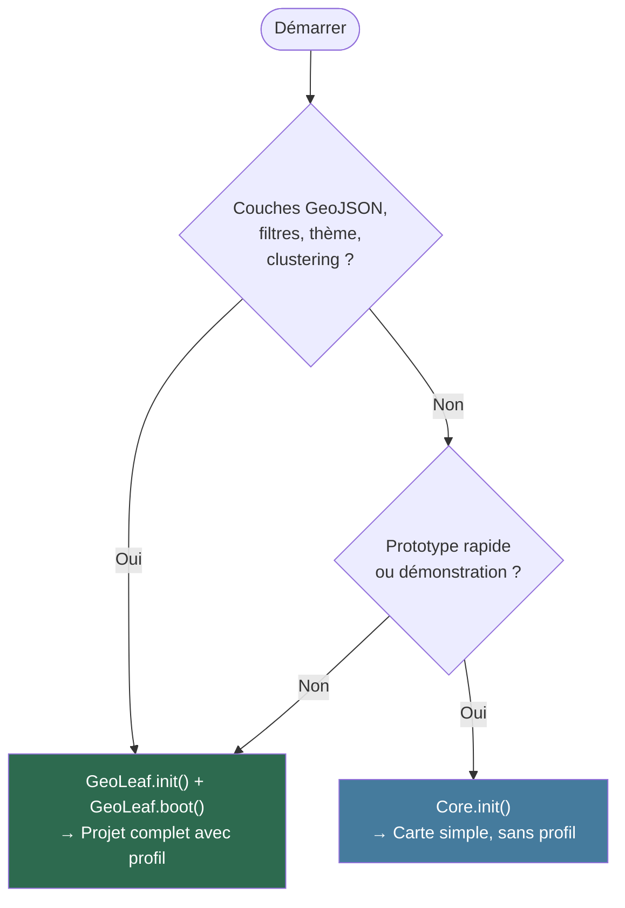

# GeoLeaf-JS — Getting Started

**Package:** `@geoleaf/core`
**S'applique à :** `@geoleaf/core` v3.x
**License:** MIT

---

## Table of contents

1. [Installation (npm/bundler — ESM)](#installation-npmbundler--esm)
2. [Installation (navigateur)](#installation-navigateur)
3. [Deux modes d'initialisation](#deux-modes-dinitialisation)
4. [First map (Core.init)](#first-map)
5. [Projet complet avec profil (GeoLeaf.init)](#projet-complet-avec-profil-geoleafinit)
6. [What's in the bundle](#whats-in-the-bundle)
7. [TypeScript usage](#typescript-usage)
8. [Build & serve en local](#build--serve-en-local)
9. [Next steps](#next-steps)

---

## Installation (npm/bundler — ESM)

```bash
npm install @geoleaf/core maplibre-gl
```

> **Peer dependency** :
>
> ```bash
> npm install maplibre-gl
> ```
>
> MapLibre GL JS est la seule dépendance externe requise. Le clustering (supercluster)
> et les sources vectorielles sont intégrés nativement dans MapLibre.

### Import

```ts
import { Core, UI, LayerManager } from "@geoleaf/core";
// La capacité filtre n'est pas un export ESM : elle vit sur le global, `GeoLeaf.Filter`.
import "@geoleaf/core/style.css";
```

Or import everything at once (triggers full boot):

```ts
import GeoLeaf from "@geoleaf/core";
```

---

## Installation (navigateur)

Incluez MapLibre GL JS **avant** GeoLeaf.

### Recommandé — auto-hébergé

C'est ce que fait l'application livrée du dépôt, et le motif n'est pas la préférence : chaque
origine tierce dans le document est une dépendance de disponibilité, une fuite de l'adresse IP de
vos utilisateurs vers un tiers, et une entrée de plus dans votre CSP. Copiez les **quatre
fichiers** depuis `node_modules/maplibre-gl/dist/` — `maplibre-gl.mjs`, `maplibre-gl-shared.mjs`,
`maplibre-gl-worker.mjs`, `maplibre-gl.css` — dans un répertoire **plat**, et servez tout depuis
votre origine.

GeoLeaf lit le moteur sur `globalThis.maplibregl`, que la v6 ne publie plus. Deux lignes le
reposent, dans un fichier placé à côté des modules copiés :

```javascript
// vendor/maplibre-gl/global.mjs
import * as maplibregl from "./maplibre-gl.mjs";
globalThis.maplibregl = maplibregl;
```

```html
<!-- MapLibre GL JS — ESM depuis la v6 ; le shim republie le global -->
<link rel="stylesheet" href="/vendor/maplibre-gl/maplibre-gl.css" />
<script type="module" src="/vendor/maplibre-gl/global.mjs"></script>

<!-- GeoLeaf Core -->
<link rel="stylesheet" href="/dist/geoleaf-main.min.css" />
<script type="module" src="/dist/geoleaf.esm.js"></script>
```

> ⚠️ **Les deux modules s'exécutent dans l'ordre du document** — garanti par la spec HTML pour
> tout module non-`async` —, donc `maplibregl` est posé avant que GeoLeaf ne le lise. Ajouter un
> `async` sur l'un des deux casse cette garantie.

> ⚠️ **Votre serveur doit connaître le type MIME de `.mjs`.** Beaucoup de configurations n'ont que
> `js` dans leur table et servent alors le module en `application/octet-stream` — le navigateur
> **refuse de l'exécuter**, sans que rien d'autre ne le signale. Côté nginx :
> `types { text/javascript mjs; }`.

> 🛑 **Ce bloc a dit l'exact inverse jusqu'à MapLibre 6, et les deux énoncés étaient justes à leur
> date.** En v5, MapLibre était un build script classique (`main: dist/maplibre-gl.js`, sans
> `module` ni `exports`) : le charger en `type="module"` ne publiait pas le global. La v6 est
> **ESM-only** — `maplibre-gl.js` et `maplibre-gl-csp.js` ne sont plus publiés du tout, et c'est
> la forme sans `type="module"` qui rend désormais un 404.

> 🛑 **N'oubliez pas `dist/chunks/`.** L'entrée en importe plusieurs **statiquement** : les copier
> est obligatoire, pas optionnel. Leurs noms portent un hachage de contenu et changent à chaque
> version — on copie le répertoire, on ne liste jamais les fichiers à la main. Détail en §7 de
> [`usage-cdn.md`](usage-cdn.md).

### Depuis un CDN

Utilisable, mais posez alors une intégrité de sous-ressource (`integrity` + `crossorigin`) sur
les balises qui en acceptent une — voir le guide de sécurité pour l'intégrateur.

⚠️ **Deux limites propres au mode CDN depuis MapLibre 6**, à connaître avant de le choisir :
`integrity` ne porte que sur une balise, donc il est **inapplicable à un module importé** depuis
un `<script type="module">` ; et ce shim en ligne exige `'unsafe-inline'` (ou un nonce/hash) dans
votre `script-src`. La recette auto-hébergée n'a ni l'une ni l'autre de ces limites.

```html
<link rel="stylesheet" href="https://cdn.jsdelivr.net/npm/maplibre-gl@6/dist/maplibre-gl.css" />
<script type="module">
    import * as maplibregl from "https://cdn.jsdelivr.net/npm/maplibre-gl@6/dist/maplibre-gl.mjs";
    globalThis.maplibregl = maplibregl;
</script>

<link
    rel="stylesheet"
    href="https://cdn.jsdelivr.net/npm/@geoleaf/core/dist/geoleaf-main.min.css"
/>
<script type="module" src="https://cdn.jsdelivr.net/npm/@geoleaf/core/dist/geoleaf.esm.js"></script>
```

Après chargement, `window.GeoLeaf` est disponible globalement.

> **Notes :**
>
> - Le nom du paquet sur npm (et CDN) est `@geoleaf/core` — pas `geoleaf`.
> - Le build UMD (`geoleaf.min.js`) n'est plus distribué depuis la v2.0.0.
> - Épinglez une version explicite en production (`@geoleaf/core@X.Y.Z`) : les URL sans version
>   ci-dessus suivent la dernière publiée, ce qui convient pour essayer et pas pour déployer.
>
> 🛑 **Cette section a enseigné `https://cdn.jsdelivr.net/npm/maplibre-gl@5/…` jusqu'au 08/08/2026 —
> soit l'origine tierce exacte que le Sprint 5 venait de retirer de l'application livrée**, dans
> le sprint qui l'a ramenée à zéro origine tierce. La page canonique enseignait ce que le dépôt
> avait démonté la veille. Elle épinglait par ailleurs `@5.0.0` là où le dépôt résolvait `^5.0.0`
> vers 5.21 : l'exemple divergeait à la fois de la pratique et de la version. Le dépôt est
> désormais en `^6.0.0`, et les recettes ci-dessus épinglent `@6`.

---

## Deux modes d'initialisation

GeoLeaf propose deux modes d'initialisation selon le niveau de complexité de votre projet :

| Mode               | API                                            | Quand l'utiliser                                                    |
| ------------------ | ---------------------------------------------- | ------------------------------------------------------------------- |
| **Carte simple**   | `Core.init({ mapId, center, zoom })`           | Prototype rapide, carte sans couches configurées via profil         |
| **Projet complet** | `GeoLeaf.init({ map, data }) + GeoLeaf.boot()` | Application avec profil JSON (couches, filtres, thème, clustering…) |



> Pour un projet réel, **préférez `GeoLeaf.init()` avec un profil** — c'est l'approche recommandée. Pour un tutoriel complet de zéro, voir [QUICKSTART_TUTORIAL.md](QUICKSTART_TUTORIAL.md).

---

## First map

### CDN/ESM (browser)

```html
<!DOCTYPE html>
<html>
    <head>
        <meta charset="UTF-8" />
        <title>GeoLeaf — First Map</title>
        <link
            rel="stylesheet"
            href="https://cdn.jsdelivr.net/npm/maplibre-gl@6/dist/maplibre-gl.css"
        />
        <link
            rel="stylesheet"
            href="https://cdn.jsdelivr.net/npm/@geoleaf/core@3.0.0/dist/geoleaf-main.min.css"
        />
        <style>
            #map {
                height: 500px;
                width: 100%;
            }
        </style>
    </head>
    <body>
        <div id="map"></div>

        <script type="module">
            import * as maplibregl from "https://cdn.jsdelivr.net/npm/maplibre-gl@6/dist/maplibre-gl.mjs";
            globalThis.maplibregl = maplibregl;
        </script>
        <script
            type="module"
            src="https://cdn.jsdelivr.net/npm/@geoleaf/core@3.0.0/dist/geoleaf.esm.js"
        ></script>
        <script type="module">
            GeoLeaf.Core.init({
                mapId: "map",
                center: [48.8566, 2.3522],
                zoom: 12,
            });
        </script>
    </body>
</html>
```

### ESM (npm/bundler)

```ts
import { Core } from "@geoleaf/core";
import "@geoleaf/core/style.css";

Core.init({
    mapId: "map",
    center: [48.8566, 2.3522],
    zoom: 12,
});
```

---

## Projet complet avec profil (GeoLeaf.init)

Pour les projets avec couches GeoJSON configurées, filtres, thème et clustering, utilisez l'API haut niveau `GeoLeaf.init()` + `GeoLeaf.boot()` :

```html
<script type="module">
    GeoLeaf.init({
        map: { target: "map" },
        data: {
            activeProfile: "mon-profil",
            profilesBasePath: "./profiles/",
        },
    });
    GeoLeaf.boot();
</script>
```

```ts
// ESM (npm)
import GeoLeaf from "@geoleaf/core";

GeoLeaf.init({
    map: { target: "map" },
    data: {
        activeProfile: "mon-profil",
        profilesBasePath: "./profiles/",
    },
});
GeoLeaf.boot();
```

`GeoLeaf.init()` charge `./profiles/mon-profil/profile.json`, puis les fichiers que **ce profil
déclare** dans sa clé `Files` — il ne les devine pas. Le layout attendu :

```
profiles/mon-profil/
├── profile.json                 ← la clé `Files` pointe tout le reste
├── config/core/                 ← themes.json · layers.json · basemaps.json · ui.json · …
└── config/plugins/              ← un fichier par capacité : taxonomy.json · filter.json · …
```

`GeoLeaf.boot()` démarre ensuite le rendu de la carte.

> Pour la structure complète d'un profil et un tutoriel pas-à-pas, voir [QUICKSTART_TUTORIAL.md](QUICKSTART_TUTORIAL.md) et [PROFILES_GUIDE.md](PROFILES_GUIDE.md).

---

## What's in the bundle

Everything. `@geoleaf/core` is batteries-included: every in-core capability — legend, labels,
filter, taxonomy, clustering, popups, themes, permalink, offline, vector tiles… — is in
`geoleaf.esm.js`, available as soon as it is parsed. There is nothing to load on demand.

- To **turn a capability off**, gate it in your profile: `modules.<id>.enabled: false`.
- To **ship less code**, compose your own entry — see
  [COOKBOOK Recipe 8](COOKBOOK.md#recipe-8--shipping-less-than-the-whole-library). A config flag
  can disable a capability, but only a build-time choice removes it from the file.

Plugins (`@geoleaf-plugins/table`, `…/addpoi`, `…/storage`…) are separate packages with their own
`<script type="module">`, loaded after the core.

> **Migrating from v2?** `GeoLeaf._loadModule()` and `GeoLeaf._loadAllSecondaryModules()` no
> longer exist. Delete the calls — nothing replaces them.

---

## TypeScript usage

GeoLeaf-JS is written in TypeScript and ships type declarations.

```ts
import { Core, UI, Helpers } from "@geoleaf/core";

Core.init({
    mapId: "map",
    center: [48.8566, 2.3522],
    zoom: 12,
});
```

Type declarations are available at `dist/types/bundle-esm-entry.d.ts` (automatically
resolved via `exports` in package.json).

---

## Build & serve en local

Pour construire et visualiser la démo localement :

```bash
# Construire les 3 variantes d'un coup
npm run build:deploy

# … ou une seule :

# deploy-full — Storage + Cog + Editor, sans AddPOI (port 8768)
npm run build:deploy:full
```

La démo est servie automatiquement par les tests E2E Playwright (ports 8766–8768). Pour une visualisation manuelle, ouvrez `deploy/index.html` via un serveur statique local (ex. extension Live Server de VS Code, ou `python -m http.server`).

Consultez [ARCHITECTURE_GUIDE.md](ARCHITECTURE_GUIDE.md) pour l'architecture détaillée du système de build et des variantes de déploiement.

---

## Next steps

| Objectif                                 | Document                                                       |
| ---------------------------------------- | -------------------------------------------------------------- |
| Projet complet de zéro                   | [QUICKSTART_TUTORIAL.md](QUICKSTART_TUTORIAL.md)               |
| Configuration d'un profil                | [PROFILES_GUIDE.md](PROFILES_GUIDE.md)                         |
| Référence JSON complète                  | [PROFILE_JSON_REFERENCE.md](PROFILE_JSON_REFERENCE.md)         |
| Développer un plugin custom              | [PLUGIN_DEVELOPMENT_GUIDE.md](PLUGIN_DEVELOPMENT_GUIDE.md)     |
| Configurer les plugins (Storage, AddPOI) | [PLUGIN_CONFIGURATION_GUIDE.md](PLUGIN_CONFIGURATION_GUIDE.md) |
| Authentification API backend             | `docs/CONNECTOR_GUIDE.md` de `@geoleaf-plugins/connector`      |
| API reference complète                   | [API_REFERENCE.md](API_REFERENCE.md)                           |
| Architecture & boot                      | [ARCHITECTURE_GUIDE.md](ARCHITECTURE_GUIDE.md)                 |
| Intégration CDN détaillée                | [usage-cdn.md](usage-cdn.md)                                   |
| Recettes courantes                       | [COOKBOOK.md](COOKBOOK.md)                                     |
| Support PWA                              | [pwa/pwa.md](pwa/pwa.md)                                       |
