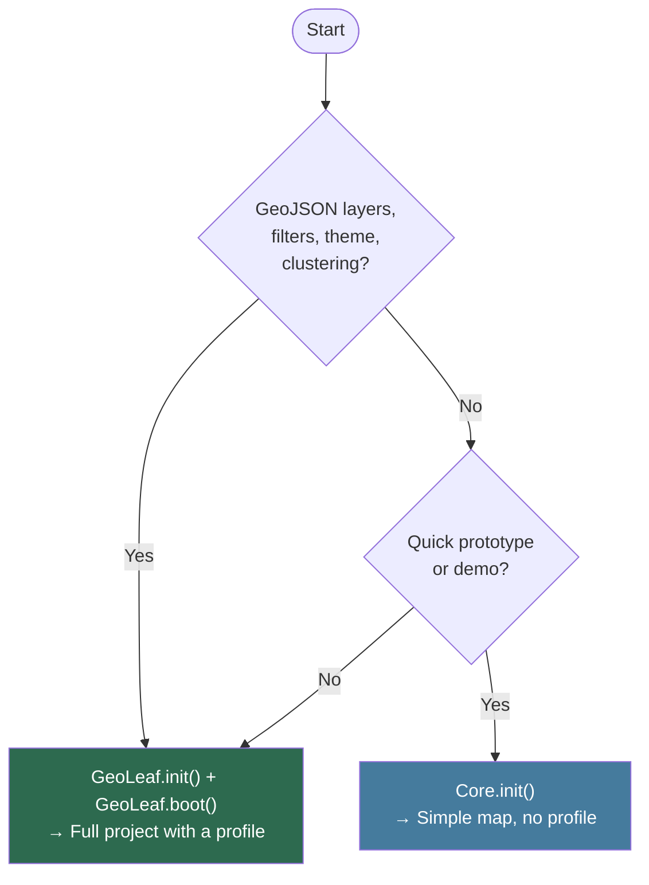

# GeoLeaf-JS — Getting Started

**Package:** `@geoleaf/core`
**Applies to:** `@geoleaf/core` v3.x
**License:** MIT

---

## Table of contents

1. [Installation (npm/bundler — ESM)](#installation-npmbundler--esm)
2. [Installation (browser)](#installation-browser)
3. [Two initialisation modes](#two-initialisation-modes)
4. [First map (Core.init)](#first-map)
5. [Full project with a profile (GeoLeaf.init)](#full-project-with-a-profile-geoleafinit)
6. [What's in the bundle](#whats-in-the-bundle)
7. [TypeScript usage](#typescript-usage)
8. [Build and serve locally](#build-and-serve-locally)
9. [Next steps](#next-steps)

---

## Installation (npm/bundler — ESM)

```bash
npm install @geoleaf/core maplibre-gl
```

> **Peer dependency**:
>
> ```bash
> npm install maplibre-gl
> ```
>
> MapLibre GL JS is the only external dependency required. Clustering (supercluster)
> and vector sources are built into MapLibre.

### Import

```ts
import { Core, UI, LayerManager } from "@geoleaf/core";
// The filter capability is not an ESM export: it lives on the global, `GeoLeaf.Filter`.
import "@geoleaf/core/style.css";
```

Or import everything at once (triggers full boot):

```ts
import GeoLeaf from "@geoleaf/core";
```

---

## Installation (browser)

Include MapLibre GL JS **before** GeoLeaf.

### Recommended — self-hosted

This is what the application shipped with the repository does, and the reason is not
preference: every third-party origin in the document is an availability dependency, a leak of
your users' IP addresses to a third party, and one more entry in your CSP. Copy the **four
files** from `node_modules/maplibre-gl/dist/` — `maplibre-gl.mjs`, `maplibre-gl-shared.mjs`,
`maplibre-gl-worker.mjs`, `maplibre-gl.css` — into a **flat** directory, and serve everything
from your own origin.

GeoLeaf reads the engine from `globalThis.maplibregl`, which v6 no longer publishes. Two lines
put it back, in a file placed next to the copied modules:

```javascript
// vendor/maplibre-gl/global.mjs
import * as maplibregl from "./maplibre-gl.mjs";
globalThis.maplibregl = maplibregl;
```

```html
<!-- MapLibre GL JS — ESM since v6; the shim republishes the global -->
<link rel="stylesheet" href="/vendor/maplibre-gl/maplibre-gl.css" />
<script type="module" src="/vendor/maplibre-gl/global.mjs"></script>

<!-- GeoLeaf Core -->
<link rel="stylesheet" href="/dist/geoleaf-main.min.css" />
<script type="module" src="/dist/geoleaf.esm.js"></script>
```

::: warning

**The two modules execute in document order** — guaranteed by the HTML specification for any
non-`async` module — so `maplibregl` is in place before GeoLeaf reads it. Adding `async` to
either of them breaks that guarantee.

:::

::: warning

**Your server must know the MIME type of `.mjs`.** Many configurations only carry `js` in their
table and then serve the module as `application/octet-stream` — the browser **refuses to execute
it**, with nothing else reporting the problem. On nginx: `types { text/javascript mjs; }`.

:::

::: warning

**MapLibre 6 is ESM-only.** `maplibre-gl.js` and `maplibre-gl-csp.js` are no longer published at
all, so a `<script>` tag without `type="module"` pointing at them returns a 404. Loading the
engine as a module and republishing the global through the shim above is now the only supported
form.

:::

::: danger

**Do not forget `dist/chunks/`.** The entry point imports several of them **statically**: copying
them is mandatory, not optional. Their names carry a content hash and change with every release —
copy the directory, never list the files by hand. Details in section 7 of
[`usage-cdn.md`](usage-cdn.md).

:::

### From a CDN

Usable, but then set subresource integrity (`integrity` + `crossorigin`) on the tags that accept
it — see the integrator security guide.

::: warning

**Two limitations specific to CDN mode since MapLibre 6**, to know before choosing it:
`integrity` only applies to a tag, so it is **inapplicable to a module imported** from a
`<script type="module">`; and the inline shim below requires `'unsafe-inline'` (or a nonce/hash)
in your `script-src`. The self-hosted recipe has neither limitation.

:::

```html
<link rel="stylesheet" href="https://cdn.jsdelivr.net/npm/maplibre-gl@6/dist/maplibre-gl.css" />
<script type="module">
    import * as maplibregl from "https://cdn.jsdelivr.net/npm/maplibre-gl@6/dist/maplibre-gl.mjs";
    globalThis.maplibregl = maplibregl;
</script>

<link
    rel="stylesheet"
    href="https://cdn.jsdelivr.net/npm/@geoleaf/core/dist/geoleaf-main.min.css"
/>
<script type="module" src="https://cdn.jsdelivr.net/npm/@geoleaf/core/dist/geoleaf.esm.js"></script>
```

Once loaded, `window.GeoLeaf` is available globally.

> **Notes:**
>
> - The package name on npm (and on CDNs) is `@geoleaf/core` — not `geoleaf`.
> - The UMD build (`geoleaf.min.js`) has not been distributed since v2.0.0.
> - Pin an explicit version in production (`@geoleaf/core@X.Y.Z`): the version-less URLs above
>   follow the latest published release, which is fine to try things out and not to deploy.

---

## Two initialisation modes

GeoLeaf offers two initialisation modes, depending on how complex the project is:

| Mode             | API                                            | When to use it                                                        |
| ---------------- | ---------------------------------------------- | --------------------------------------------------------------------- |
| **Simple map**   | `Core.init({ mapId, center, zoom })`           | Quick prototype, map without profile-configured layers                |
| **Full project** | `GeoLeaf.init({ map, data }) + GeoLeaf.boot()` | Application with a JSON profile (layers, filters, theme, clustering…) |



> For a real project, **prefer `GeoLeaf.init()` with a profile** — this is the recommended approach. For a complete tutorial from scratch, see [QUICKSTART_TUTORIAL.md](QUICKSTART_TUTORIAL.md).

---

## First map

### CDN/ESM (browser)

```html
<!DOCTYPE html>
<html>
    <head>
        <meta charset="UTF-8" />
        <title>GeoLeaf — First Map</title>
        <link
            rel="stylesheet"
            href="https://cdn.jsdelivr.net/npm/maplibre-gl@6/dist/maplibre-gl.css"
        />
        <link
            rel="stylesheet"
            href="https://cdn.jsdelivr.net/npm/@geoleaf/core@3.0.0/dist/geoleaf-main.min.css"
        />
        <style>
            #map {
                height: 500px;
                width: 100%;
            }
        </style>
    </head>
    <body>
        <div id="map"></div>

        <script type="module">
            import * as maplibregl from "https://cdn.jsdelivr.net/npm/maplibre-gl@6/dist/maplibre-gl.mjs";
            globalThis.maplibregl = maplibregl;
        </script>
        <script
            type="module"
            src="https://cdn.jsdelivr.net/npm/@geoleaf/core@3.0.0/dist/geoleaf.esm.js"
        ></script>
        <script type="module">
            GeoLeaf.Core.init({
                mapId: "map",
                center: [48.8566, 2.3522],
                zoom: 12,
            });
        </script>
    </body>
</html>
```

### ESM (npm/bundler)

```ts
import { Core } from "@geoleaf/core";
import "@geoleaf/core/style.css";

Core.init({
    mapId: "map",
    center: [48.8566, 2.3522],
    zoom: 12,
});
```

---

## Full project with a profile (GeoLeaf.init)

For projects with profile-configured GeoJSON layers, filters, theme and clustering, use the high-level `GeoLeaf.init()` + `GeoLeaf.boot()` API:

```html
<script type="module">
    GeoLeaf.init({
        map: { target: "map" },
        data: {
            activeProfile: "mon-profil",
            profilesBasePath: "./profiles/",
        },
    });
    GeoLeaf.boot();
</script>
```

```ts
// ESM (npm)
import GeoLeaf from "@geoleaf/core";

GeoLeaf.init({
    map: { target: "map" },
    data: {
        activeProfile: "mon-profil",
        profilesBasePath: "./profiles/",
    },
});
GeoLeaf.boot();
```

`GeoLeaf.init()` loads `./profiles/mon-profil/profile.json`, then the files **that profile
declares** in its `Files` key — it does not guess them. The expected layout:

```
profiles/mon-profil/
├── profile.json                 ← the `Files` key points to everything else
├── config/core/                 ← themes.json · layers.json · basemaps.json · ui.json · …
└── config/plugins/              ← one file per capability: taxonomy.json · filter.json · …
```

`GeoLeaf.boot()` then starts rendering the map.

> For the full structure of a profile and a step-by-step tutorial, see [QUICKSTART_TUTORIAL.md](QUICKSTART_TUTORIAL.md) and [PROFILES_GUIDE.md](PROFILES_GUIDE.md).

---

## What's in the bundle

Everything. `@geoleaf/core` is batteries-included: every in-core capability — legend, labels,
filter, taxonomy, clustering, popups, themes, permalink, offline, vector tiles… — is in
`geoleaf.esm.js`, available as soon as it is parsed. There is nothing to load on demand.

- To **turn a capability off**, gate it in your profile: `modules.<id>.enabled: false`.
- To **ship less code**, compose your own entry — see
  [COOKBOOK Recipe 8](COOKBOOK.md#recipe-8--shipping-less-than-the-whole-library). A config flag
  can disable a capability, but only a build-time choice removes it from the file.

Plugins (`@geoleaf-plugins/table`, `…/addpoi`, `…/storage`…) are separate packages with their own
`<script type="module">`, loaded after the core.

> **Migrating from v2?** `GeoLeaf._loadModule()` and `GeoLeaf._loadAllSecondaryModules()` no
> longer exist. Delete the calls — nothing replaces them.

---

## TypeScript usage

GeoLeaf-JS is written in TypeScript and ships type declarations.

```ts
import { Core, UI, Helpers } from "@geoleaf/core";

Core.init({
    mapId: "map",
    center: [48.8566, 2.3522],
    zoom: 12,
});
```

Type declarations are available at `dist/types/bundle-esm-entry.d.ts` (automatically
resolved via `exports` in package.json).

---

## Build and serve locally

To build and preview the demo locally:

```bash
# Build all three variants in one go
npm run build:deploy

# … or a single one:

# deploy-full — Storage + Cog + Editor, without AddPOI (port 8768)
npm run build:deploy:full
```

The demo is served automatically by the Playwright E2E tests (ports 8766–8768). For a manual preview, open `deploy/index.html` through a local static server (for example the VS Code Live Server extension, or `python -m http.server`).

See [ARCHITECTURE_GUIDE.md](ARCHITECTURE_GUIDE.md) for the detailed architecture of the build system and of the deployment variants.

---

## Next steps

| Goal                                  | Document                                                       |
| ------------------------------------- | -------------------------------------------------------------- |
| Full project from scratch             | [QUICKSTART_TUTORIAL.md](QUICKSTART_TUTORIAL.md)               |
| Configuring a profile                 | [PROFILES_GUIDE.md](PROFILES_GUIDE.md)                         |
| Complete JSON reference               | [PROFILE_JSON_REFERENCE.md](PROFILE_JSON_REFERENCE.md)         |
| Developing a custom plugin            | [PLUGIN_DEVELOPMENT_GUIDE.md](PLUGIN_DEVELOPMENT_GUIDE.md)     |
| Configuring plugins (Storage, AddPOI) | [PLUGIN_CONFIGURATION_GUIDE.md](PLUGIN_CONFIGURATION_GUIDE.md) |
| Backend API authentication            | `docs/CONNECTOR_GUIDE.md` in `@geoleaf-plugins/connector`      |
| Complete API reference                | [API_REFERENCE.md](API_REFERENCE.md)                           |
| Architecture and boot                 | [ARCHITECTURE_GUIDE.md](ARCHITECTURE_GUIDE.md)                 |
| Detailed CDN integration              | [usage-cdn.md](usage-cdn.md)                                   |
| Common recipes                        | [COOKBOOK.md](COOKBOOK.md)                                     |
| PWA support                           | [pwa/pwa.md](pwa/pwa.md)                                       |
