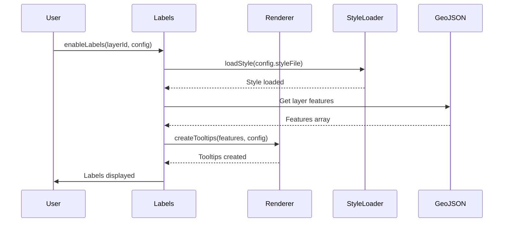

# GeoLeaf.Labels – Labels module documentation

**Files**:

- `src/modules/optional/labels/` (labels, label-renderer, label-button-manager)

---

## Overview

The **GeoLeaf.Labels** module provides a system for managing **floating labels** (permanent tooltips) on map features. It displays text or icons above GeoJSON features permanently, with zoom control and customisable styles.

### Main responsibilities

- **Label display** - Permanent tooltips on features

- **Per-layer management** - Enable/disable per layer

- **Custom styles** - Loading of CSS style files

- **Zoom control** - Conditional display according to the zoom level

- **Dynamic rendering** - Templates for label content

---

## Architecture

The Labels module is made of 3 sub-modules:

### 1. **labels.js** (365 lines)

Main orchestrating module:

- System initialisation

- Layer state management

- Layer event binding

- Public API

### 2. **label-renderer.js**

Responsible for rendering the tooltips:

- Creation of MapLibre GL tooltips

- Template application

- Dynamic updates

- Lifecycle management

---

## Public API

### `Labels.init(options?)`

Initialises the labels system.

```js
GeoLeaf.Labels.init();
// or with options
GeoLeaf.Labels.init({ defaultEnabled: false });
```

---

### `Labels.initializeLayerLabels(layerId)`

Initialises the labels system for a given layer (prepares it without enabling it).

```js
GeoLeaf.Labels.initializeLayerLabels("poi_restaurants");
```

---

### `Labels.enableLabels(layerId, labelConfig?, showImmediately?)`

Enables labels for a layer. **Asynchronous method.**

**Parameters**:

- `layerId` (String) - ID of the GeoJSON layer
- `labelConfig` (Object, optional) - Label configuration (see [Configuration in profile.json](#configuration-in-profilejson))
- `showImmediately` (Boolean, optional) - Display immediately without waiting for the zoom (default: `false`)

```js
// Simple activation
await GeoLeaf.Labels.enableLabels("poi_restaurants");

// With an inline config
await GeoLeaf.Labels.enableLabels("poi_restaurants", {
    property: "name",
    minZoom: 14,
});

// Immediate display
await GeoLeaf.Labels.enableLabels("poi_hotels", { property: "name" }, true);
```

---

### `Labels.disableLabels(layerId)`

Disables labels for a layer.

```js
GeoLeaf.Labels.disableLabels("poi_restaurants");
```

---

### `Labels.toggleLabels(layerId)` → `boolean`

Toggles the label state (on ↔ off). Returns the new state.

```js
const isNowEnabled = GeoLeaf.Labels.toggleLabels("poi_restaurants");
```

---

### `Labels.areLabelsEnabled(layerId)` → `boolean`

Checks whether labels are active for a layer.

```js
if (GeoLeaf.Labels.areLabelsEnabled("poi_restaurants")) {
    console.log("Labels actifs");
}
```

---

### `Labels.hasLabelConfig(layerId)` → `boolean`

Checks whether a label configuration exists for a layer.

```js
if (GeoLeaf.Labels.hasLabelConfig("poi_restaurants")) {
    // config present
}
```

---

### `Labels.refreshLabels(layerId)`

Clears and recreates the labels of a layer (useful after a data update).

```js
GeoLeaf.Labels.refreshLabels("poi_restaurants");
```

---

## Configuration in profile.json

Labels can be configured directly in the profile file:

```json
{
    "geojsonLayers": [
        {
            "id": "poi_restaurants",

            "name": "Restaurants",

            "source": "data/restaurants.geojson",

            "labels": {
                "enabled": true,

                "property": "name",

                "minZoom": 14,

                "direction": "top",

                "styleFile": "styles/labels/restaurants.css"
            }
        },

        {
            "id": "tourism_routes",

            "name": "Itinéraires touristiques",

            "source": "data/routes.geojson",

            "labels": {
                "enabled": true,

                "template": "{name} - {distance}km",

                "minZoom": 12,

                "className": "route-label"
            }
        }
    ]
}
```

---

## Usage examples

### Example 1: simple labels

```js
// Initialise the module

GeoLeaf.Labels.init();

// Load a GeoJSON layer

/* GeoLeaf.GeoJSON is internal - configure through geojsonLayers in geoleaf.config.json */ // Enable labels on the cities layer

await GeoLeaf.Labels.enableLabels("cities", {
    property: "name",
    minZoom: 10,
    direction: "center",
});
```

### Example 2: labels with a function template

```js
await GeoLeaf.Labels.enableLabels("poi_shops", {
    template: (props) => {
        const icon = props.type === "grocery" ? "🛒" : "🏪";
        return `${icon} ${props.name}`;
    },
    minZoom: 15,
    className: "shop-label",
});
```

### Example 3: labels driven by zoom

```js
const map = GeoLeaf.Core.getMap();

map.on("zoomend", () => {
    const zoom = map.getZoom();

    if (zoom >= 14) {
        GeoLeaf.Labels.enableLabels("poi_restaurants", {
            property: "name",
        });
    } else {
        GeoLeaf.Labels.disableLabels("poi_restaurants");
    }
});
```

### Example 4: multilingual labels

```js
const currentLang = localStorage.getItem("language") || "fr";

await GeoLeaf.Labels.enableLabels("poi_museums", {
    template: (props) => props[`name_${currentLang}`] || props.name,
    minZoom: 13,
});
```

---

## Custom CSS styles

### Structure of a style file

```css
/* styles/labels/custom.css */

/* Base label style (custom GeoLeaf class) */
.gl-label.custom-label {
    background: rgba(0, 0, 0, 0.8);
    border: 2px solid #fff;
    border-radius: 4px;
    color: white;
    font-weight: bold;
    font-size: 12px;
    padding: 4px 8px;
    box-shadow: 0 2px 4px rgba(0, 0, 0, 0.3);
}

.gl-label.custom-label.highlighted {
    background: rgba(255, 140, 0, 0.9);
    border-color: #ff8c00;
}
```

### Applying the style

```js
await GeoLeaf.Labels.enableLabels("my_layer", {
    property: "name",
    styleFile: "styles/labels/custom.css",
    className: "custom-label",
});
```

---

## Internal behaviour

### 1. Module state

```js
const _state = {
    // Map: layerId -> { enabled, config, tooltips }

    layers: new Map(),

    // Cache: styleFile -> styleObject

    styleCache: new Map(),

    // Zoom listener flag

    zoomListenerAttached: false,
};
```

### 2. Activation sequence



### 3. Zoom handling

The module attaches a listener to the map `zoomend` event to update label display according to the `minZoom` and `maxZoom` constraints:

```js
map.on("zoomend", () => {
    const zoom = map.getZoom();

    _state.layers.forEach((layerState, layerId) => {
        const { config, tooltips } = layerState;

        if (config.minZoom && zoom < config.minZoom) {
            // Hide the tooltips

            tooltips.forEach((t) => t.remove());
        } else if (config.maxZoom && zoom > config.maxZoom) {
            // Hide the tooltips

            tooltips.forEach((t) => t.remove());
        } else {
            // Show the tooltips

            tooltips.forEach((t) => t.addTo(map));
        }
    });
});
```

---

## Limitations and notes

### 1. Performance

- **Large feature counts**: beyond 500-1000 labels visible at the same time, performance can degrade

- **Remedy**: use `minZoom` to limit display, or enable clustering

### 2. Compatibility

- Compatible with GeoJSON layers

- Not compatible with direct POI markers (use the POI popup system instead)

- Works with every geometry type (Point, LineString, Polygon)

### 3. Styles

- CSS styles must be loaded before display

- The style cache is kept for the whole session

- CSS files must be reachable (CORS)

---

## Related modules

- **GeoLeaf.GeoJSON** - Supplies the layers and features the labels are attached to

- **GeoLeaf.Log** - Operation logging

- **MapLibre GL JS** - Native MapLibre GL JS popup and overlay used for the tooltips

---

## Future improvements

### Planned

- [ ] Icon support inside labels

- [ ] Enter/exit animation for labels

- [ ] Collision detection (avoid overlap)

- [ ] Smart label clustering

- [ ] Rich HTML templates (not text only)

### Under discussion

- [ ] Inline label editing

- [ ] Label export to PDF/image

- [ ] Synchronisation with the filter system

---

## Full example

```js
// 1. Initialise GeoLeaf

GeoLeaf.init({
    map: {
        target: "map",

        center: [48.8566, 2.3522],

        zoom: 12,
    },
});

// 2. Initialise the Labels module

GeoLeaf.Labels.init();

// 3. Load GeoJSON data

/* GeoLeaf.GeoJSON is internal - configure through geojsonLayers in geoleaf.config.json */ // 4. Enable labels with a custom style

await GeoLeaf.Labels.enableLabels("restaurants", {
    template: (props) => `${props.name} ⭐${props.rating}`,
    minZoom: 14,
    maxZoom: 18,
    direction: "top",
    styleFile: "styles/labels/restaurants.css",
    className: "restaurant-label",
});

// 5. Handle interactions

document.getElementById("toggle-labels").addEventListener("click", () => {
    const isNowEnabled = GeoLeaf.Labels.toggleLabels("restaurants");
    // or with an explicit check:
    // if (GeoLeaf.Labels.areLabelsEnabled("restaurants")) {
    //     GeoLeaf.Labels.disableLabels("restaurants");
    // } else {
    //     GeoLeaf.Labels.enableLabels("restaurants", { property: "name" });
    // }
});
```

---

## Label configuration in style files

Map label configuration is defined in the style files (`styles/*.json`) of each layer, through the `label` property (an object):

```json
{
    "label": {
        "enabled": true,
        "visibleByDefault": false,
        "field": "properties.nom",
        "font": {
            "family": "Arial",
            "sizePt": 11,
            "weight": 50,
            "bold": false,
            "italic": false
        },
        "color": "#333333",
        "opacity": 1,
        "buffer": {
            "enabled": true,
            "color": "#ffffff",
            "opacity": 0.8,
            "sizePx": 2
        },
        "background": {
            "enabled": false,
            "color": "#ffffff",
            "opacity": 0.9,
            "paddingPx": 3
        },
        "offset": {
            "distancePx": 8,
            "angleDeg": 0
        }
    }
}
```

| Property               | Type    | Description                                        |
| ---------------------- | ------- | -------------------------------------------------- |
| `enabled`              | boolean | Enable labels for this style                       |
| `visibleByDefault`     | boolean | Show labels as soon as the layer is enabled        |
| `field`                | string  | GeoJSON field to display (e.g. `"properties.nom"`) |
| `font.family`          | string  | Font family                                        |
| `font.sizePt`          | number  | Font size in points                                |
| `font.weight`          | number  | Weight (0–900)                                     |
| `font.bold` / `italic` | boolean | Text formatting                                    |
| `color`                | string  | Text colour (hex/CSS)                              |
| `opacity`              | number  | Text opacity (0–1)                                 |
| `buffer.enabled`       | boolean | Enable the outline halo                            |
| `buffer.color`         | string  | Halo colour                                        |
| `buffer.sizePx`        | number  | Halo thickness in pixels                           |
| `background.enabled`   | boolean | Enable the label background                        |
| `background.paddingPx` | number  | Inner padding of the background, in pixels         |
| `offset.distancePx`    | number  | Distance between the label and the feature         |
| `offset.angleDeg`      | number  | Offset angle in degrees (0 = up)                   |

> See [schema/README.md](../schema/README.md) for the full specification.
