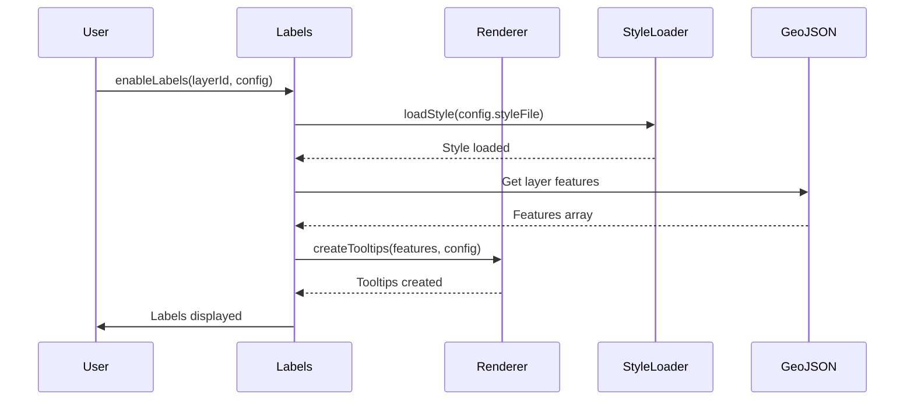

# GeoLeaf.Labels – Labels module documentation

**Files**:

- `src/modules/optional/labels/` (labels, label-renderer, label-button-manager)

---

## Overview

The **GeoLeaf.Labels** module provides a system for managing **floating labels** (permanent tooltips) on map features. It displays text or icons above GeoJSON features permanently, with zoom control and customisable styles.

### Main responsibilities

- **Label display** - Permanent tooltips on features

- **Per-layer management** - Enable/disable per layer

- **Custom styles** - Loading of CSS style files

- **Zoom control** - Conditional display according to the zoom level

- **Dynamic rendering** - Templates for label content

---

## Architecture

The Labels module is made of 3 sub-modules:

### 1. **labels.js** (365 lines)

Main orchestrating module:

- System initialisation

- Layer state management

- Layer event binding

- Public API

### 2. **label-renderer.js**

Responsible for rendering the tooltips:

- Creation of MapLibre GL tooltips

- Template application

- Dynamic updates

- Lifecycle management

---

## Public API

### `Labels.init(options?)`

Initialises the labels system.

```js
GeoLeaf.Labels.init();
// or with options
GeoLeaf.Labels.init({ defaultEnabled: false });
```

---

### `Labels.initializeLayerLabels(layerId)`

Initialises the labels system for a given layer (prepares it without enabling it).

```js
GeoLeaf.Labels.initializeLayerLabels("poi_restaurants");
```

---

### `Labels.enableLabels(layerId, labelConfig?, showImmediately?)`

Enables labels for a layer. **Asynchronous method.**

**Parameters**:

- `layerId` (String) - ID of the GeoJSON layer
- `labelConfig` (Object, optional) - Used only when the layer DECLARES no label configuration
  (neither in its style nor in its config — see [Configuration on the layer](#configuration-on-the-layer)):
  `enabled` and `labelId` (the property displayed) are then required; `minZoom` and `maxZoom`
  apply only together.
- `showImmediately` (Boolean, optional) - Display at once (default: `true`). A declared
  `visibleByDefault` takes precedence over it.

```js
// A layer whose style or config declares its labels: nothing else to pass
await GeoLeaf.Labels.enableLabels("poi_restaurants");

// A layer that declares none: the inline configuration
await GeoLeaf.Labels.enableLabels("poi_hotels", { enabled: true, labelId: "name" });

// Prepared, but not shown until toggled
await GeoLeaf.Labels.enableLabels("poi_hotels", { enabled: true, labelId: "name" }, false);
```

---

### `Labels.disableLabels(layerId)`

Disables labels for a layer.

```js
GeoLeaf.Labels.disableLabels("poi_restaurants");
```

---

### `Labels.toggleLabels(layerId)` → `boolean`

Toggles the label state (on ↔ off). Returns the new state.

```js
const isNowEnabled = GeoLeaf.Labels.toggleLabels("poi_restaurants");
```

---

### `Labels.areLabelsEnabled(layerId)` → `boolean`

Checks whether labels are active for a layer.

```js
if (GeoLeaf.Labels.areLabelsEnabled("poi_restaurants")) {
    console.log("Labels actifs");
}
```

---

### `Labels.hasLabelConfig(layerId)` → `boolean`

Checks whether a label configuration exists for a layer.

```js
if (GeoLeaf.Labels.hasLabelConfig("poi_restaurants")) {
    // config present
}
```

---

### `Labels.refreshLabels(layerId)`

Clears and recreates the labels of a layer (useful after a data update).

```js
GeoLeaf.Labels.refreshLabels("poi_restaurants");
```

---

## Configuration on the layer

Labels are usually declared in the layer's style file ([below](#label-configuration-in-style-files)).
Since v3.7.0 a layer's config file (`layers/<id>/<id>_config.json`, or a `Layers.create()`
definition) may also declare them itself, in a `labels` block — the **same object, with the same
meaning**, as a style file's `label`:

```json
{
    "id": "poi_restaurants",
    "styles": { "default": "defaut.json" },
    "labels": {
        "enabled": true,
        "visibleByDefault": true,
        "field": "name",
        "offset": { "placement": "top", "distancePx": 8 }
    }
}
```

- A style that carries its own `label` object **keeps priority**; the layer's block applies
  otherwise — including when the default style file is missing and the layer is drawn with the
  neutral style.
- `visibleByDefault` defaults to `false`, as in a style file: the labels exist, and the layer
  manager's labels button shows them.
- The zoom window of labels (`labelScale`) stays a style-file key.

> ⚠️ **An older form of this block was documented here, and none of it was ever read**:
> `property`, `template`, `minZoom`, `direction`, `className` and `styleFile`, under a
> `geojsonLayers` array. None of these keys reaches the renderer, and `styleFile` is refused
> outright (`Obsolete configuration: labels.styleFile`). Before v3.7.0 the block itself only
> TRIGGERED the labels' initialisation; nothing read its content.

---

## Usage examples

### Example 1: labels declared by the style or the layer — nothing to call

When a layer's style file declares its `label` object — or, since v3.7.0, its config declares a
`labels` block ([above](#configuration-on-the-layer)) — the loader initialises the labels itself.
No call is needed: the layer manager's labels button shows and hides them.

### Example 2: labels on a layer that declares none

```js
await GeoLeaf.Labels.enableLabels("cities", {
    enabled: true,
    labelId: "name",
    minZoom: 10,
    maxZoom: 18,
});
```

- `enabled` and `labelId` are both required; `labelId` names the feature property displayed.
- `minZoom` and `maxZoom` apply only when both are given.
- The labels show at once, unless the third argument is `false`.
- ⚠️ A label configuration the layer DECLARES — in its style or its config — takes precedence
  over these options, and a declared `enabled: false` wins over them too.

### Example 3: toggling from your own control

```js
const shown = GeoLeaf.Labels.toggleLabels("cities"); // true when now shown
```

`toggleLabels` acts only on a layer whose labels are declared — by its style or its config.

---

## Label styling

Labels are rendered as a MapLibre symbol layer: their look is declared in the label object — the
style file's `label`, or the layer's `labels` block — never in CSS. `font.sizePt`, `color`,
`opacity`, `buffer` and `offset` reach the renderer; see the table below for the keys the schema
accepts. There is no label stylesheet: `styleFile` is refused
(`Obsolete configuration: labels.styleFile`), and `template`, `property`, `direction` and
`className`, which older versions of this page taught, are not read.

---

## Internal behaviour

### 1. Module state

```js
const _state = {
    // Map: layerId -> { enabled, config, tooltips }

    layers: new Map(),

    // Cache: styleFile -> styleObject

    styleCache: new Map(),

    // Zoom listener flag

    zoomListenerAttached: false,
};
```

### 2. Activation sequence



### 3. Zoom handling

The module attaches a listener to the map `zoomend` event to update label display according to the `minZoom` and `maxZoom` constraints:

```js
map.on("zoomend", () => {
    const zoom = map.getZoom();

    _state.layers.forEach((layerState, layerId) => {
        const { config, tooltips } = layerState;

        if (config.minZoom && zoom < config.minZoom) {
            // Hide the tooltips

            tooltips.forEach((t) => t.remove());
        } else if (config.maxZoom && zoom > config.maxZoom) {
            // Hide the tooltips

            tooltips.forEach((t) => t.remove());
        } else {
            // Show the tooltips

            tooltips.forEach((t) => t.addTo(map));
        }
    });
});
```

---

## Limitations and notes

### 1. Performance

- **Large feature counts**: beyond 500-1000 labels visible at the same time, performance can degrade

- **Remedy**: use `minZoom` to limit display, or enable clustering

### 2. Compatibility

- Compatible with GeoJSON layers

- Not compatible with direct POI markers (use the POI popup system instead)

- Works with every geometry type (Point, LineString, Polygon)

### 3. Styles

- CSS styles must be loaded before display

- The style cache is kept for the whole session

- CSS files must be reachable (CORS)

---

## Related modules

- **GeoLeaf.GeoJSON** - Supplies the layers and features the labels are attached to

- **GeoLeaf.Log** - Operation logging

- **MapLibre GL JS** - Native MapLibre GL JS popup and overlay used for the tooltips

---

## Future improvements

### Planned

- [ ] Icon support inside labels

- [ ] Enter/exit animation for labels

- [ ] Collision detection (avoid overlap)

- [ ] Smart label clustering

- [ ] Rich HTML templates (not text only)

### Under discussion

- [ ] Inline label editing

- [ ] Label export to PDF/image

- [ ] Synchronisation with the filter system

---

## Full example

```js
// 1. Initialise GeoLeaf

GeoLeaf.init({
    map: {
        target: "map",

        center: [48.8566, 2.3522],

        zoom: 12,
    },
});

// 2. Initialise the Labels module

GeoLeaf.Labels.init();

// 3. Layers are declared by the profile. A layer whose style or config declares its labels
//    needs no call; for one that declares none, give the inline configuration:

await GeoLeaf.Labels.enableLabels("restaurants", {
    enabled: true,
    labelId: "name",
    minZoom: 14,
    maxZoom: 18,
});

// 5. Handle interactions

document.getElementById("toggle-labels").addEventListener("click", () => {
    const isNowEnabled = GeoLeaf.Labels.toggleLabels("restaurants");
    // or with an explicit check:
    // if (GeoLeaf.Labels.areLabelsEnabled("restaurants")) {
    //     GeoLeaf.Labels.disableLabels("restaurants");
    // } else {
    //     GeoLeaf.Labels.enableLabels("restaurants", { enabled: true, labelId: "name" });
    // }
});
```

---

## Label configuration in style files

Map label configuration is defined in the style files (`styles/*.json`) of each layer, through the `label` property (an object):

```json
{
    "label": {
        "enabled": true,
        "visibleByDefault": false,
        "field": "properties.nom",
        "font": {
            "family": "Arial",
            "sizePt": 11,
            "weight": 50,
            "bold": false,
            "italic": false
        },
        "color": "#333333",
        "opacity": 1,
        "buffer": {
            "enabled": true,
            "color": "#ffffff",
            "opacity": 0.8,
            "sizePx": 2
        },
        "background": {
            "enabled": false,
            "color": "#ffffff",
            "opacity": 0.9,
            "paddingPx": 3
        },
        "offset": {
            "placement": "top",
            "distancePx": 8
        }
    }
}
```

| Property               | Type    | Description                                                                      |
| ---------------------- | ------- | -------------------------------------------------------------------------------- |
| `enabled`              | boolean | Enable labels for this style                                                     |
| `visibleByDefault`     | boolean | Show labels as soon as the layer is enabled                                      |
| `field`                | string  | GeoJSON field to display (e.g. `"properties.nom"`)                               |
| `font.family`          | string  | Font family                                                                      |
| `font.sizePt`          | number  | Font size in points                                                              |
| `font.weight`          | number  | Weight (0–900)                                                                   |
| `font.bold` / `italic` | boolean | Text formatting                                                                  |
| `color`                | string  | Text colour (hex/CSS)                                                            |
| `opacity`              | number  | Text opacity (0–1)                                                               |
| `buffer.enabled`       | boolean | Enable the outline halo                                                          |
| `buffer.color`         | string  | Halo colour                                                                      |
| `buffer.sizePx`        | number  | Halo thickness in pixels                                                         |
| `background.enabled`   | boolean | Enable the label background                                                      |
| `background.paddingPx` | number  | Inner padding of the background, in pixels                                       |
| `offset.distancePx`    | number  | Distance between the label and the feature                                       |
| `offset.placement`     | string  | Side the label sits on (`center`, `top`, `bottom`, `left`, `right`, `top-left`…) |

> See [schema/README.md](../schema/README.md) for the full specification.
