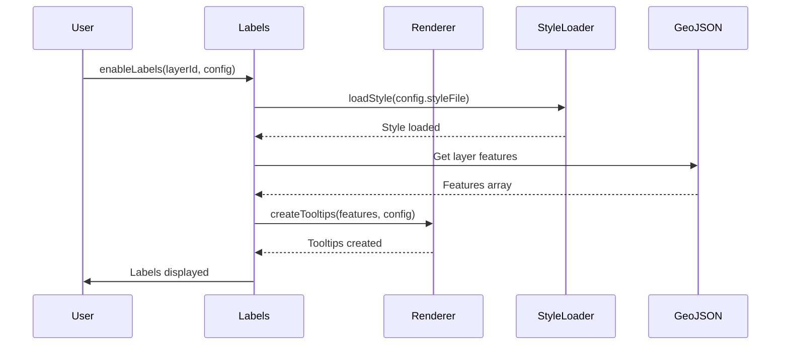

# GeoLeaf.Labels – Documentation du module Labels

**Version**: 3.0.0

**Fichiers**:

- `src/modules/optional/labels/` (labels, label-renderer, label-button-manager)

    **Dernière mise à jour :** mars 2026

---

## 📌 Vue d'ensemble

Le module **GeoLeaf.Labels** fournit un système de gestion des **étiquettes flottantes** (tooltips permanents) sur les entités cartographiques. Il permet d'afficher du texte ou des icônes au-dessus des features GeoJSON de manière permanente, avec contrôle du zoom et des styles personnalisables.

### Responsabilités principales

- ✅ **Affichage d'étiquettes** - Tooltips permanents sur les features

- ✅ **Gestion par couche** - Activation/désactivation par layer

- ✅ **Styles personnalisés** - Chargement de fichiers de style CSS

- ✅ **Contrôle du zoom** - Affichage conditionnel selon le niveau de zoom

- ✅ **Rendu dynamique** - Templates pour le contenu des labels

---

## 🏗️ Architecture

Le module Labels est composé de 3 sous-modules :

### 1. **labels.js** (365 lignes)

Module principal orchestrateur :

- Initialisation du système

- Gestion de l'état des layers

- Attachement des événements de couches

- API publique

### 2. **label-renderer.js**

Responsable du rendu des tooltips :

- Création des tooltips MapLibre GL

- Application des templates

- Mise à jour dynamique

- Gestion du cycle de vie

---

## 📚 API Publique

### `Labels.init(options?)`

Initialise le système de labels.

```js
GeoLeaf.Labels.init();
// ou avec options
GeoLeaf.Labels.init({ defaultEnabled: false });
```

---

### `Labels.initializeLayerLabels(layerId)`

Initialise le système de labels pour une couche spécifique (prépare sans activer).

```js
GeoLeaf.Labels.initializeLayerLabels("poi_restaurants");
```

---

### `Labels.enableLabels(layerId, labelConfig?, showImmediately?)`

Active les labels pour une couche. **Méthode asynchrone.**

**Paramètres** :

- `layerId` (String) - ID de la couche GeoJSON
- `labelConfig` (Object, optionnel) - Configuration des labels (voir [Configuration dans profile.json](#configuration-dans-profilejson))
- `showImmediately` (Boolean, optionnel) - Afficher immédiatement sans attendre le zoom (défaut: `false`)

```js
// Activation simple
await GeoLeaf.Labels.enableLabels("poi_restaurants");

// Avec config inline
await GeoLeaf.Labels.enableLabels("poi_restaurants", {
    property: "name",
    minZoom: 14,
});

// Affichage immédiat
await GeoLeaf.Labels.enableLabels("poi_hotels", { property: "name" }, true);
```

---

### `Labels.disableLabels(layerId)`

Désactive les labels pour une couche.

```js
GeoLeaf.Labels.disableLabels("poi_restaurants");
```

---

### `Labels.toggleLabels(layerId)` → `boolean`

Bascule l'état des labels (actif ↔ inactif). Retourne le nouvel état.

```js
const isNowEnabled = GeoLeaf.Labels.toggleLabels("poi_restaurants");
```

---

### `Labels.areLabelsEnabled(layerId)` → `boolean`

Vérifie si les labels sont actifs pour une couche.

```js
if (GeoLeaf.Labels.areLabelsEnabled("poi_restaurants")) {
    console.log("Labels actifs");
}
```

---

### `Labels.hasLabelConfig(layerId)` → `boolean`

Vérifie si une configuration de labels existe pour une couche.

```js
if (GeoLeaf.Labels.hasLabelConfig("poi_restaurants")) {
    // config présente
}
```

---

### `Labels.refreshLabels(layerId)`

Vide et recrée les labels d'une couche (utile après mise à jour des données).

```js
GeoLeaf.Labels.refreshLabels("poi_restaurants");
```

---

## 🎨 Configuration dans profile.json

Les labels peuvent être configurés directement dans le fichier de profil :

```json
{
    "geojsonLayers": [
        {
            "id": "poi_restaurants",

            "name": "Restaurants",

            "source": "data/restaurants.geojson",

            "labels": {
                "enabled": true,

                "property": "name",

                "minZoom": 14,

                "direction": "top",

                "styleFile": "styles/labels/restaurants.css"
            }
        },

        {
            "id": "tourism_routes",

            "name": "Itinéraires touristiques",

            "source": "data/routes.geojson",

            "labels": {
                "enabled": true,

                "template": "{name} - {distance}km",

                "minZoom": 12,

                "className": "route-label"
            }
        }
    ]
}
```

---

## 💡 Exemples d'utilisation

### Exemple 1 : Labels simples

```js
// Initialiser le module

GeoLeaf.Labels.init();

// Charger une couche GeoJSON

/* GeoLeaf.GeoJSON est interne - configurer via geojsonLayers dans geoleaf.config.json */ // Activer les labels sur les villes

await GeoLeaf.Labels.enableLabels("cities", {
    property: "name",
    minZoom: 10,
    direction: "center",
});
```

### Exemple 2 : Labels avec template fonction

```js
await GeoLeaf.Labels.enableLabels("poi_shops", {
    template: (props) => {
        const icon = props.type === "grocery" ? "🛒" : "🏪";
        return `${icon} ${props.name}`;
    },
    minZoom: 15,
    className: "shop-label",
});
```

### Exemple 3 : Labels avec gestion du zoom

```js
const map = GeoLeaf.Core.getMap();

map.on("zoomend", () => {
    const zoom = map.getZoom();

    if (zoom >= 14) {
        GeoLeaf.Labels.enableLabels("poi_restaurants", {
            property: "name",
        });
    } else {
        GeoLeaf.Labels.disableLabels("poi_restaurants");
    }
});
```

### Exemple 4 : Labels multilingues

```js
const currentLang = localStorage.getItem("language") || "fr";

await GeoLeaf.Labels.enableLabels("poi_museums", {
    template: (props) => props[`name_${currentLang}`] || props.name,
    minZoom: 13,
});
```

---

## 🎨 Styles CSS personnalisés

### Structure d'un fichier de style

```css
/* styles/labels/custom.css */

/* Style de base du label (classe GeoLeaf custom) */
.gl-label.custom-label {
    background: rgba(0, 0, 0, 0.8);
    border: 2px solid #fff;
    border-radius: 4px;
    color: white;
    font-weight: bold;
    font-size: 12px;
    padding: 4px 8px;
    box-shadow: 0 2px 4px rgba(0, 0, 0, 0.3);
}

.gl-label.custom-label.highlighted {
    background: rgba(255, 140, 0, 0.9);
    border-color: #ff8c00;
}
```

### Application du style

```js
await GeoLeaf.Labels.enableLabels("my_layer", {
    property: "name",
    styleFile: "styles/labels/custom.css",
    className: "custom-label",
});
```

---

## 🔧 Fonctionnement interne

### 1. État du module

```js
const _state = {
    // Map: layerId -> { enabled, config, tooltips }

    layers: new Map(),

    // Cache: styleFile -> styleObject

    styleCache: new Map(),

    // Flag écouteur de zoom

    zoomListenerAttached: false,
};
```

### 2. Séquence d'activation



### 3. Gestion du zoom

Le module attache un écouteur sur l'événement `zoomend` de la carte pour mettre à jour l'affichage des labels selon les contraintes `minZoom` et `maxZoom` :

```js
map.on("zoomend", () => {
    const zoom = map.getZoom();

    _state.layers.forEach((layerState, layerId) => {
        const { config, tooltips } = layerState;

        if (config.minZoom && zoom < config.minZoom) {
            // Cacher les tooltips

            tooltips.forEach((t) => t.remove());
        } else if (config.maxZoom && zoom > config.maxZoom) {
            // Cacher les tooltips

            tooltips.forEach((t) => t.remove());
        } else {
            // Afficher les tooltips

            tooltips.forEach((t) => t.addTo(map));
        }
    });
});
```

---

## ⚠️ Limitations et notes

### 1. Performance

- ⚠️ **Grand nombre de features** : Au-delà de 500-1000 labels visibles simultanément, les performances peuvent se dégrader

- ✅ **Solution** : Utiliser `minZoom` pour limiter l'affichage ou activer le clustering

### 2. Compatibilité

- ✅ Compatible avec les couches GeoJSON

- ⚠️ Non compatible avec les marqueurs POI directs (utiliser le système de popup POI à la place)

- ✅ Fonctionne avec tous les types de géométries (Point, LineString, Polygon)

### 3. Styles

- Les styles CSS doivent être chargés avant l'affichage

- Le cache des styles est conservé pendant toute la session

- Les fichiers CSS doivent être accessibles (CORS)

---

## 🔗 Modules liés

- **GeoLeaf.GeoJSON** - Fournit les couches et features pour les labels

- **GeoLeaf.Log** - Journalisation des opérations

- **MapLibre GL JS** - Popup et overlay natifs MapLibre GL JS pour les tooltips

---

## 📈 Améliorations futures

### Prévues

- [ ] Support des icônes dans les labels

- [ ] Animation d'entrée/sortie des labels

- [ ] Collision detection (éviter la superposition)

- [ ] Clustering intelligent des labels

- [ ] Templates HTML enrichis (pas seulement texte)

### En discussion

- [ ] Édition inline des labels

- [ ] Export des labels en PDF/Image

- [ ] Synchronisation avec le système de filtres

---

## 📝 Exemple complet

```js
// 1. Initialiser GeoLeaf

GeoLeaf.init({
    map: {
        target: "map",

        center: [48.8566, 2.3522],

        zoom: 12,
    },
});

// 2. Initialiser le module Labels

GeoLeaf.Labels.init();

// 3. Charger des données GeoJSON

/* GeoLeaf.GeoJSON est interne - configurer via geojsonLayers dans geoleaf.config.json */ // 4. Activer les labels avec style personnalisé

await GeoLeaf.Labels.enableLabels("restaurants", {
    template: (props) => `${props.name} ⭐${props.rating}`,
    minZoom: 14,
    maxZoom: 18,
    direction: "top",
    styleFile: "styles/labels/restaurants.css",
    className: "restaurant-label",
});

// 5. Gérer les interactions

document.getElementById("toggle-labels").addEventListener("click", () => {
    const isNowEnabled = GeoLeaf.Labels.toggleLabels("restaurants");
    // ou avec vérification explicite :
    // if (GeoLeaf.Labels.areLabelsEnabled("restaurants")) {
    //     GeoLeaf.Labels.disableLabels("restaurants");
    // } else {
    //     GeoLeaf.Labels.enableLabels("restaurants", { property: "name" });
    // }
});
```

---

## 📄 Configuration du label dans les fichiers de style

La configuration des étiquettes cartographiques est définie dans les fichiers de style (`styles/*.json`) de chaque couche, via la propriété `label` (objet) :

```json
{
    "label": {
        "enabled": true,
        "visibleByDefault": false,
        "field": "properties.nom",
        "font": {
            "family": "Arial",
            "sizePt": 11,
            "weight": 50,
            "bold": false,
            "italic": false
        },
        "color": "#333333",
        "opacity": 1,
        "buffer": {
            "enabled": true,
            "color": "#ffffff",
            "opacity": 0.8,
            "sizePx": 2
        },
        "background": {
            "enabled": false,
            "color": "#ffffff",
            "opacity": 0.9,
            "paddingPx": 3
        },
        "offset": {
            "distancePx": 8,
            "angleDeg": 0
        }
    }
}
```

| Propriété              | Type    | Description                                           |
| ---------------------- | ------- | ----------------------------------------------------- |
| `enabled`              | boolean | Activer les étiquettes pour ce style                  |
| `visibleByDefault`     | boolean | Afficher les étiquettes dès l'activation de la couche |
| `field`                | string  | Champ GeoJSON à afficher (ex. `"properties.nom"`)     |
| `font.family`          | string  | Famille de police                                     |
| `font.sizePt`          | number  | Taille de police en points                            |
| `font.weight`          | number  | Graisse (0–900)                                       |
| `font.bold` / `italic` | boolean | Formatage texte                                       |
| `color`                | string  | Couleur du texte (hex/CSS)                            |
| `opacity`              | number  | Opacité du texte (0–1)                                |
| `buffer.enabled`       | boolean | Activer le halo de contour                            |
| `buffer.color`         | string  | Couleur du halo                                       |
| `buffer.sizePx`        | number  | Épaisseur du halo en pixels                           |
| `background.enabled`   | boolean | Activer le fond de l'étiquette                        |
| `background.paddingPx` | number  | Marge interne du fond en pixels                       |
| `offset.distancePx`    | number  | Distance du label par rapport à la feature            |
| `offset.angleDeg`      | number  | Angle d'offset en degrés (0 = haut)                   |

> Voir [schema/README.md](../schema/README.md) pour la spécification complète.
