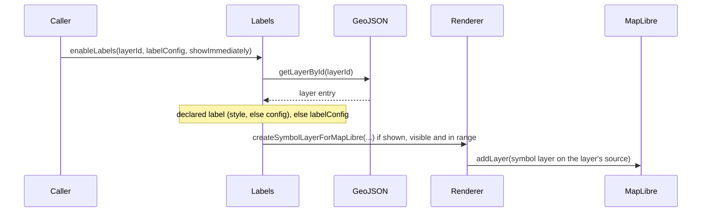

# GeoLeaf.Labels – Labels module documentation

**Files**:

- `src/capabilities/labels/` (labels, label-renderer, label-button-manager)
- `src/kernel/geojson/layer-labels.ts` (which label configuration a layer wears)

---

## Overview

The **GeoLeaf.Labels** module draws the value of a feature property as text on the map, for GeoJSON layers. The labels are a native MapLibre `symbol` layer placed on the layer's own source — no DOM node per feature — and can be bounded by a scale or zoom window.

### Main responsibilities

- **Label display** - One MapLibre symbol layer per labelled layer

- **Per-layer management** - Enable/disable per layer

- **Label look** - Size, colour, halo and placement, declared in the label object

- **Scale or zoom window** - Conditional display according to the map scale or zoom level

- **Layer manager button** - The 🏷️ toggle on each layer row

---

## Architecture

The Labels module rests on three main files:

### 1. **labels.ts**

Main orchestrating module:

- Label state per layer

- Choice of the configuration: the declared one, else the inline one

- Zoom listener

- Public API

### 2. **label-renderer.ts**

Builds the MapLibre symbol layer:

- `text-field` from the displayed property

- Text size, colour, opacity and halo from the label object

- Placement (`text-anchor` + `text-radial-offset`) from `offset`

- Font stack taken from the loaded map style

### 3. **label-button-manager.ts**

The 🏷️ button of each layer row in the layer manager — enabled while the layer declares labels and
is visible.

---

## Public API

### `Labels.init(options?)`

Lifecycle entry point; it only logs. The labels capability calls it when it mounts, and the
`zoomend` listener is attached later, once a layer's labels are prepared. `options` is ignored, and
there is no need to call it yourself.

```js
GeoLeaf.Labels.init();
```

---

### `Labels.initializeLayerLabels(layerId)`

Rebuilds a layer's labels from its declared configuration — its style's `label` object, else its
config's `labels` block. The loader calls it as the layer comes up, and a style change calls it
again. The layer's label state is purged first; the labels are then prepared, and shown when the
declaration says `visibleByDefault: true`, while the layer is visible. A layer that declares no
labels, or declares `enabled: false`, is left with none — including labels an inline
`enableLabels()` call had set.

```js
GeoLeaf.Labels.initializeLayerLabels("poi_restaurants");
```

---

### `Labels.enableLabels(layerId, labelConfig?, showImmediately?)`

Prepares a layer's labels — from its declared configuration, else from an inline one — and shows
them unless told otherwise. **Asynchronous method.**

**Parameters**:

- `layerId` (String) - ID of the GeoJSON layer
- `labelConfig` (Object, optional) - What is read from it depends on the layer:
    - on a layer that DECLARES no label configuration (neither in its style nor in its config — see
      [Configuration on the layer](#configuration-on-the-layer)), it is the whole configuration:
      `enabled: true` and `labelId` (the property displayed) are required;
    - on a layer that declares one, the declaration wins — a declared `enabled: false` disables the
      labels whatever is passed here — and only two things are still read: `labelId`, when the
      declaration names no `field`, and `minZoom`/`maxZoom`, when the layer's current style sets
      no `labelScale`.

    `minZoom` and `maxZoom` apply only together. When the call prepares labels, the object stays
    with the layer's label state until another `enableLabels()` call or a re-initialisation (the
    loader, a style change) replaces it. The core makes such a call itself when a layer whose
    declaration says `visibleByDefault: true` is shown again: its labels are prepared anew with an
    empty configuration, and what an earlier call passed is no longer read.

- `showImmediately` (Boolean, optional) - Show the labels once prepared (default: `true`); they
  render only while the layer is visible. A declared `visibleByDefault` takes precedence over it,
  and a config's `labels` block that omits it counts as `visibleByDefault: false`.

```js
// A layer whose style or config declares its labels: nothing else to pass
await GeoLeaf.Labels.enableLabels("poi_restaurants");

// A layer that declares none: the inline configuration, shown at once
// (labels render only while the layer is visible)
await GeoLeaf.Labels.enableLabels("poi_hotels", { enabled: true, labelId: "name" });
```

Labels set up from an inline configuration are switched on and off by your own calls to
`enableLabels()` and `disableLabels()`: `toggleLabels()` and the layer manager's labels button act
only on a layer whose style or config declares labels. Hiding the layer — the layer manager's
visibility toggle, `GeoJSON.hideLayer()`, a theme — turns them off as `disableLabels()` does, and
showing it again does not bring them back: call `enableLabels()` again.

---

### `Labels.disableLabels(layerId)`

Disables labels for a layer and removes the rendered ones. The prepared configuration is kept: on a
layer that declares its labels, `toggleLabels()` brings them back; labels set up inline come back
only through another `enableLabels()` call.

```js
GeoLeaf.Labels.disableLabels("poi_restaurants");
```

---

### `Labels.toggleLabels(layerId)` → `boolean`

Toggles the label state (on ↔ off) and returns the new state. **It acts only on a layer whose style
or config declares labels (`enabled: true`)**, once they are prepared; on any other layer —
including one labelled by an inline `enableLabels()` configuration — it returns `false` and changes
nothing.

```js
const isNowEnabled = GeoLeaf.Labels.toggleLabels("poi_restaurants");
```

---

### `Labels.areLabelsEnabled(layerId)` → `boolean`

Checks whether labels are active for a layer.

```js
if (GeoLeaf.Labels.areLabelsEnabled("poi_restaurants")) {
    console.log("Labels actifs");
}
```

---

### `Labels.hasLabelConfig(layerId)` → `boolean`

Checks whether a layer's labels are prepared — by the loader, or by an `enableLabels()` call.
Prepared labels can be off.

```js
if (GeoLeaf.Labels.hasLabelConfig("poi_restaurants")) {
    // config present
}
```

---

### `Labels.refreshLabels(layerId)`

Clears and recreates the labels of a layer, when they are on and the layer is visible (useful
after a data update).

```js
GeoLeaf.Labels.refreshLabels("poi_restaurants");
```

---

## Configuration on the layer

Labels are usually declared in the layer's style file ([below](#label-configuration-in-style-files)).
Since v3.7.0 a layer's config file (`layers/<id>/<id>_config.json`, or a `Layers.create()`
definition) may also declare them itself, in a `labels` block — the **same object, with the same
meaning**, as a style file's `label`:

```json
{
    "id": "poi_restaurants",
    "styles": { "default": "defaut.json" },
    "labels": {
        "enabled": true,
        "visibleByDefault": true,
        "field": "name",
        "offset": { "placement": "top", "distancePx": 8 }
    }
}
```

- A style that carries its own `label` object **keeps priority**; the layer's block applies
  otherwise — including when the default style file is missing and the layer is drawn with the
  neutral style.
- `visibleByDefault` defaults to `false`, as in a style file: the labels exist, and the layer
  manager's labels button shows them.
- The zoom window of labels (`labelScale`) stays a style-file key.

> ⚠️ **An older form of this block was documented here, and none of it was ever read**:
> `property`, `template`, `minZoom`, `direction`, `className` and `styleFile`, under a
> `geojsonLayers` array. None of these keys reaches the renderer, and `styleFile` is refused
> outright (`Obsolete configuration: labels.styleFile`). Before v3.7.0 the block itself only
> TRIGGERED the labels' initialisation; nothing read its content.

---

## Usage examples

### Example 1: labels declared by the style or the layer — nothing to call

When a layer's style file declares its `label` object — or, since v3.7.0, its config declares a
`labels` block ([above](#configuration-on-the-layer)) — the loader initialises the labels itself.
No call is needed: the layer manager's labels button shows and hides them.

### Example 2: labels on a layer that declares none

```js
await GeoLeaf.Labels.enableLabels("cities", {
    enabled: true,
    labelId: "name",
    minZoom: 10,
    maxZoom: 18,
});
```

- `enabled` and `labelId` are both required; `labelId` names the feature property displayed.
- `minZoom` and `maxZoom` apply only when both are given.
- The labels show at once while the layer is visible, unless the third argument is `false`.
- ⚠️ On a layer that DECLARES its labels — in its style or its config — the declaration wins: a
  declared `enabled: false` disables them, and the look comes from the declaration. From these
  options only `labelId` (when the declaration names no `field`) and `minZoom`/`maxZoom` (when the
  layer's current style sets no `labelScale`) are still read.
- These labels are not declared, so `toggleLabels()` and the layer manager's labels button leave
  them alone — the button stays disabled. A style change removes them: it rebuilds the layer's
  labels from its declaration.

### Example 3: toggling from your own control

```js
// A layer whose style or config declares its labels
const shown = GeoLeaf.Labels.toggleLabels("poi_restaurants"); // true when now on

// The inline-labelled layer of Example 2: toggleLabels() would return false and change nothing
if (GeoLeaf.Labels.areLabelsEnabled("cities")) {
    GeoLeaf.Labels.disableLabels("cities");
} else {
    await GeoLeaf.Labels.enableLabels("cities", {
        enabled: true,
        labelId: "name",
        minZoom: 10,
        maxZoom: 18,
    });
}
```

`toggleLabels` acts only on a layer whose labels are declared — by its style or its config.

---

## Label styling

Labels are rendered as a MapLibre symbol layer: their look is declared in the label object — the
style file's `label`, or the layer's `labels` block — never in CSS. `font.sizePt`, `color`,
`opacity`, `buffer` and `offset` reach the renderer; see
[Label configuration in style files](#label-configuration-in-style-files) for the keys the schema
accepts. There is no label stylesheet: `styleFile` is refused
(`Obsolete configuration: labels.styleFile`), and `template`, `property`, `direction` and
`className`, which older versions of this page taught, are not read.

---

## Internal behaviour

### 1. Module state

```js
// labels.ts
const _state = {
    // layerId -> { enabled, config, labelStyle, tooltips }
    layers: new Map(),

    // The zoomend subscription: whether it is armed, on which map, with which handler
    zoomListenerAttached: false,
    zoomMap: null,
    zoomHandler: null,
};
```

- `enabled` — whether the layer's labels are on;
- `config` — the `labelConfig` of the `enableLabels()` call that prepared them (`{}` when the
  loader or a style change did);
- `labelStyle` — the resolved label: the declared one (with the style's `labelScale`), or one
  built from `config`;
- `tooltips` — despite its name, no DOM tooltip: it holds the function that removes the layer's
  MapLibre symbol layer.

### 2. Activation sequence



### 3. Zoom handling

Once a layer's labels are prepared, the module subscribes to the map's `zoomend` event — once, on
the current map. On each zoom end, every layer whose labels are on is re-evaluated:

- a hidden layer's labels are removed;
- a `labelScale` from the layer's current style wins: its `minScale`/`maxScale` bound the map
  scale;
- otherwise `minZoom` and `maxZoom` from the stored `labelConfig`, when both are set, bound the
  zoom level;
- labels are created when the layer enters its window, and removed when it leaves it.

---

## Limitations and notes

### 1. Performance

- **Dense layers**: MapLibre places the labels and drops those that would overlap
  (`text-allow-overlap: false`), but a dense layer still costs placement work

- **Remedy**: bound the labels — a `labelScale` in the style file, or `minZoom` and `maxZoom`
  together in an inline configuration

### 2. Compatibility

- Compatible with GeoJSON layers

- Not compatible with direct POI markers (use the POI popup system instead)

- Works with every geometry type (Point, LineString, Polygon)

### 3. Styles

- No CSS is involved: the look comes from the label object

- Of the `font` keys only `sizePt` is rendered; the font stack is the first plain `text-font` array
  among the loaded map style's symbol layers (fallback `Noto Sans Regular`)

- Of the `buffer` keys only `enabled`, `color` and `sizePx` are rendered

---

## Related modules

- **GeoLeaf.GeoJSON** - Supplies the layers and features the labels are attached to

- **GeoLeaf.Log** - Operation logging

- **MapLibre GL JS** - Native `symbol` layer that draws the labels

---

## Full example

```js
// 1. Initialise GeoLeaf

GeoLeaf.init({
    map: {
        target: "map",

        center: [48.8566, 2.3522],

        zoom: 12,
    },
});

// 2. A layer whose style or config declares its labels needs no call. Once the "restaurants"
//    layer is loaded — it declares none — give it an inline configuration:

const restaurantLabels = {
    enabled: true,
    labelId: "name",
    minZoom: 14,
    maxZoom: 18,
};
await GeoLeaf.Labels.enableLabels("restaurants", restaurantLabels);

// 3. Handle interactions. toggleLabels() would change nothing here: it acts only on a layer
//    whose style or config declares its labels.

document.getElementById("toggle-labels").addEventListener("click", async () => {
    if (GeoLeaf.Labels.areLabelsEnabled("restaurants")) {
        GeoLeaf.Labels.disableLabels("restaurants");
    } else {
        await GeoLeaf.Labels.enableLabels("restaurants", restaurantLabels);
    }
});
```

---

## Label configuration in style files

Map label configuration is defined in the style files (`styles/*.json`) of each layer, through the
`label` property (an object) — or in the layer's config, through a `labels` block holding the same
object ([above](#configuration-on-the-layer)):

```json
{
    "label": {
        "enabled": true,
        "visibleByDefault": false,
        "field": "nom",
        "font": {
            "family": "Arial",
            "sizePt": 11,
            "weight": 50,
            "bold": false,
            "italic": false
        },
        "color": "#333333",
        "opacity": 1,
        "buffer": {
            "enabled": true,
            "color": "#ffffff",
            "opacity": 0.8,
            "sizePx": 2
        },
        "offset": {
            "placement": "top",
            "distancePx": 8
        }
    }
}
```

Both schemas — a style file's `label` object and a layer config's `labels` block — accept exactly
these keys, plus `_comment*` keys; any other key is refused.

| Property               | Type                  | Description                                                                                                                          |
| ---------------------- | --------------------- | ------------------------------------------------------------------------------------------------------------------------------------ |
| `enabled`              | boolean, **required** | Must be `true` for labels to exist; any other value disables them                                                                    |
| `visibleByDefault`     | boolean               | Labels shown when the layer loads, without user action (default `false`)                                                             |
| `field`                | string                | Name of the feature property displayed, e.g. `"nom"` — a plain property name, not a `properties.` path                               |
| `font.family`          | string                | Accepted, not rendered: the font stack comes from the loaded map style                                                               |
| `font.sizePt`          | number (1–72)         | Text size in points, converted to pixels (12 px when absent)                                                                         |
| `font.weight`          | number (1–100)        | Accepted, not rendered                                                                                                               |
| `font.bold` / `italic` | boolean               | Accepted, not rendered                                                                                                               |
| `color`                | string (`#rrggbb`)    | Text colour (default `#000000`)                                                                                                      |
| `opacity`              | number (0–1)          | Text opacity (default `1`)                                                                                                           |
| `buffer.enabled`       | boolean               | Draws a halo around the text when `true` (default `false`)                                                                           |
| `buffer.color`         | string (`#rrggbb`)    | Halo colour (default `#ffffff`)                                                                                                      |
| `buffer.sizePx`        | number (≥ 0)          | Halo width in pixels (default `2`)                                                                                                   |
| `buffer.opacity`       | number (0–1)          | Accepted, not rendered                                                                                                               |
| `buffer.noFill`        | boolean               | Accepted, not rendered                                                                                                               |
| `offset.placement`     | string                | Side the label sits on: `center` (default), `top`, `bottom`, `left`, `right`, `top-left`, `top-right`, `bottom-left`, `bottom-right` |
| `offset.distancePx`    | number (≥ 0)          | Gap in pixels between the feature and the nearest edge of the text (default `12`); ignored with `center`                             |

The scale window of the labels is not in this object: it is the style file's root `labelScale`
key, `{ "minScale": …, "maxScale": … }` (scale denominators, each nullable).

> See [schema/README.md](../schema/README.md) for the full specification.
