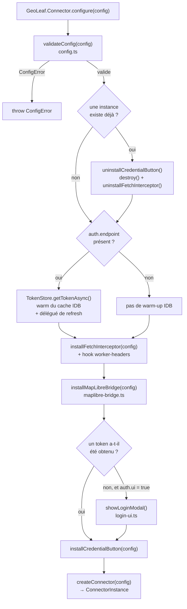

# plugin-connector — Internals (`src/`)

Ce document décrit les **interactions entre modules** du plugin `@geoleaf-plugins/connector` :
l'ordre dans lequel `configure()` installe ses crochets, par quel canal chaque requête reçoit son
en-tête, et comment le pont MapLibre se raccroche à une carte qui n'existe pas encore.

**Ne pas importer ces modules directement** — utiliser l'API publique via `GeoLeaf.Connector` ou
`createConnector()`.

> ⚠️ **Ce document ne liste plus les exports, ni les interfaces, ni l'arbre des imports** — et
> l'omission est délibérée. Il l'a fait jusqu'au 14/08/2026, et **toutes ses erreurs étaient là** :
> un champ `auth.credentials` qui n'a jamais existé, `configure()` et `ConnectorInstance` attribués
> à `entry.ts` alors qu'ils vivent dans `connector-api.ts`, `TokenRecord` et `DataFormat` annoncés
> exportés sans l'être, trois modules sur onze absents de la table. Une signature recopiée à la main
> rediverge ; celle du fichier, non. **Pour un module : lire son fichier.** Ce qui reste ici est ce
> qu'aucun fichier ne porte seul.

---

## Modules

Rôle seulement — les exports se lisent dans le fichier.

| Fichier                | Rôle                                                                  |
| ---------------------- | --------------------------------------------------------------------- |
| `entry.ts`             | Point d'entrée — boot, auto-bootstrap du bouton, ré-exports ESM       |
| `connector-api.ts`     | **L'orchestrateur** — `configure()`, le singleton global, la fabrique |
| `public-api.ts`        | Construction du namespace `GeoLeaf.Connector`                         |
| `config.ts`            | Types et validation de `ConnectorConfig`                              |
| `auth-client.ts`       | Appels HTTP vers l'endpoint d'authentification                        |
| `token-store.ts`       | Persistance IndexedDB + cache RAM + refresh JWT silencieux            |
| `fetch-interceptor.ts` | Monkey-patch `window.fetch` — injection de l'en-tête `Authorization`  |
| `maplibre-bridge.ts`   | `map.setTransformRequest()` pour les tuiles MVT / PMTiles             |
| `credential-button.ts` | Injection du bouton credential (desktop + mobile)                     |
| `login-ui.ts`          | Modal de connexion accessible (feuille de style adoptée)              |
| `format-detector.ts`   | Détection du format de données depuis une URL — fonction pure         |
| `lang/`                | Dictionnaires i18n de la modal                                        |

⚠️ **L'orchestrateur est `connector-api.ts`, pas `entry.ts`.** C'est l'erreur que l'ancien arbre des
dépendances portait, et elle induit en erreur sur le point qui compte : `entry.ts` n'importe que
quatre modules et délègue ; c'est `connector-api.ts` qui en tire sept et tient l'état.

---

## Flux — `configure()`

Deux étapes sont faciles à manquer en lisant le code de haut en bas :

- **`configure()` est ré-entrant.** Un second appel démonte l'instance précédente avant tout le
  reste — bouton, `destroy()`, interception `fetch`. Sans quoi deux monkey-patches se
  superposeraient sur `window.fetch`.
- **Le hook worker.** L'interception pose aussi `__GEOLEAF_WORKER_HEADERS_HOOK__` sur le global :
  un Worker n'hérite pas du `window.fetch` patché, il doit demander ses en-têtes.

---

## Routage des requêtes

| Format détecté                                 | Canal d'injection                                    |
| ---------------------------------------------- | ---------------------------------------------------- |
| `geojson`, `flatgeobuf`, `kml`, `csv`, `oapif` | monkey-patch de `window.fetch`                       |
| `mvt`, `pmtiles`                               | `map.setTransformRequest()` via `maplibre-bridge.ts` |

La séparation est **nécessaire**, pas esthétique : MapLibre gère ses requêtes de tuiles en interne
et n'utilise pas `window.fetch`. Le partage se lit dans `fetch-interceptor.ts`, sur une seule
condition — l'intercepteur se retire pour `pmtiles` et `mvt`, et le pont les reprend.

⚠️ **`transformRequest` est SYNCHRONE**, donc le pont lit le token par `getTokenSync()` — le cache
RAM seul. Conséquence à connaître avant de s'étonner : **si la RAM est froide, la requête de tuile
part SANS en-tête.** Le pont déclenche au passage un `getTokenAsync()` non bloquant, qui réchauffe
le cache pour les requêtes suivantes ; le warm IDB au début de `configure()` réduit la fenêtre, il
ne la ferme pas.

---

## Pont MapLibre — stratégie de résolution

Le pont s'installe en **trois temps**, parce que la carte peut naître avant ou après le plugin :

1. **Immédiat** — si la carte est disponible au moment de `configure()`.
2. **Différé** — via un écouteur `geoleaf:map:ready` si elle ne l'est pas encore.
3. **Défensif** — ré-installation sur `geoleaf:basemap:change`, un `setStyle()` pouvant emporter le
   hook.

L'accès à la carte passe par `globalThis.GeoLeaf.Core.getMap().getNativeMap()` — **aucun import de
`@geoleaf/core`**. Ce n'est pas une commodité : le plugin doit rester chargeable sans que le core
soit un module de son graphe.
